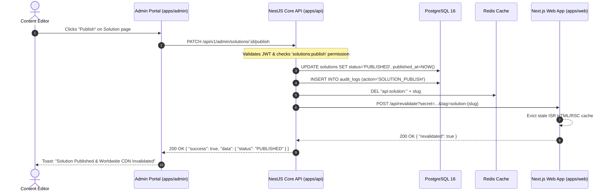
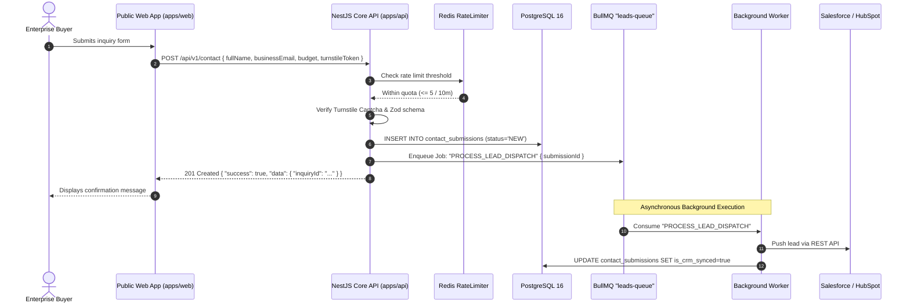

# REST API Architecture Specification
## Project: Gypsym Technology Digital Platform & Enterprise CMS

---

| Document Metadata | Value |
| :--- | :--- |
| **Document Version** | 1.0.0-API-SPEC |
| **Status** | Approved Engineering Specification |
| **Author** | Principal Backend Engineer & NestJS API Architect |
| **Baseline Standards** | [PRD.md](file:///e:/dev/gypsym-advance-site/PRD.md) v1.0.0, [HLD.md](file:///e:/dev/gypsym-advance-site/HLD.md) v1.0.0, [LLD.md](file:///e:/dev/gypsym-advance-site/LLD.md) v1.0.0 |
| **Base URL** | `/api/v1` |
| **Transport Protocol** | HTTPS / TLS 1.3 |
| **Serialization** | JSON (`application/json; charset=utf-8`) |
| **Date** | September 2026 |

---

## 1. Global API Conventions & Standards

### 1.1 Uniform Response Envelope
All API responses (success and error) are wrapped in a standard envelope to guarantee deterministic consumption across frontend clients (`apps/web`, `apps/admin`).

#### 1.1.1 Single Resource Success Envelope (`200 OK`, `201 Created`)
```typescript
interface ApiSuccessResponse<T> {
  success: true;
  data: T;
  meta?: Record<string, unknown>;
  timestamp: string;       // ISO-8601 UTC
  requestId: string;       // UUIDv7 unique to this single request
  correlationId: string;   // Edge correlation ID propagated across upstream/downstream services
}
```

#### 1.1.2 Paginated Collection Success Envelope (`200 OK`)
```typescript
interface ApiPaginatedResponse<T> {
  success: true;
  data: T[];
  meta: {
    pagination: {
      totalItems: number;
      itemCount: number;
      itemsPerPage: number;
      totalPages: number;
      currentPage: number;
      hasNextPage: boolean;
      hasPreviousPage: boolean;
      nextCursor?: string | null;  // When cursor pagination is active
    };
    filters?: Record<string, unknown>;
    sort?: string;
  };
  timestamp: string;
  requestId: string;
  correlationId: string;
}
```

#### 1.1.3 Standard Error Envelope (`4xx`, `5xx`)
```typescript
interface ApiErrorResponse {
  success: false;
  error: {
    code: string;            // Standardized error code (e.g., 'AUTH_INVALID_CREDENTIALS')
    message: string;         // Human-readable summary
    details?: Array<{
      field?: string;        // Path to invalid parameter/body property (e.g., 'email', 'bodyContent.sections[0]')
      issue: string;         // Descriptive validation issue
      constraint?: string;   // Failed constraint (e.g., 'isEmail', 'min', 'maxLength')
    }>;
  };
  timestamp: string;
  requestId: string;
  correlationId: string;
}
```

---

### 1.2 Pagination Strategy: Offset vs. Cursor

| Criteria | Standard Offset-Based Pagination | Cursor-Based Pagination |
| :--- | :--- | :--- |
| **Mechanism** | Query parameters: `?page=1&limit=20` | Query parameters: `?cursor=eyJpZCI...&limit=20` |
| **Use Cases** | Admin Tables (Users, Leads, Blog list, Audit logs) where jumping to specific page numbers and viewing total counts is required. | High-frequency append-only feeds (Audit event stream, Public search results, Activity timelines) to eliminate duplicate/skipped records during concurrent writes. |
| **SQL Implementation** | `OFFSET (page - 1) * limit LIMIT limit` with `COUNT(*)` | `WHERE id > cursor_id ORDER BY id ASC LIMIT limit` |
| **Max Limit Ceiling** | 100 records per page (default: 20) | 100 records per page (default: 20) |

---

### 1.3 Filtering, Sorting & Search Conventions

* **Filtering:** Standard key-value query parameters or nested bracket syntax for operators:
  * Exact match: `?status=PUBLISHED&departmentId=d824d5b2-...`
  * Range filters: `?publishedAt[gte]=2026-01-01T00:00:00Z&publishedAt[lte]=2026-12-31T23:59:59Z`
  * In-array match: `?status=PUBLISHED,SCHEDULED`
* **Sorting:** Query parameter `?sort=field` (ascending) or `?sort=-field` (descending). Multi-column sort supported via comma separation:
  * Example: `?sort=-publishedAt,displayOrder` (primary sort: newest first, secondary sort: lowest display order).
* **Search:** Standard query parameter `?q=search+term`. Executes PostgreSQL Full-Text Search with trigram fuzzy fallbacks across titles, excerpts, and tags.

---

### 1.4 HTTP Status Codes & Error Registry

| HTTP Status | Semantic Usage in Gypsym API |
| :--- | :--- |
| **`200 OK`** | Successful retrieval (`GET`), idempotent updates (`PUT`), partial updates (`PATCH`). |
| **`201 Created`** | Successful entity creation (`POST`). Includes `Location` header pointing to new resource. |
| **`204 No Content`** | Successful deletion (`DELETE`) or actions producing no response body (e.g., `/auth/logout`). |
| **`304 Not Modified`** | Returned when client transmits matching `If-None-Match` (ETag) or `If-Modified-Since`. |
| **`400 Bad Request`** | Malformed JSON, missing required headers, or unparseable query syntax. |
| **`401 Unauthorized`** | Missing, malformed, or expired JWT Access Token. |
| **`403 Forbidden`** | Authenticated user lacks the requisite RBAC permission (e.g., lacks `pages:publish`). |
| **`404 Not Found`** | Resource identified by UUID or slug does not exist or has been soft-deleted. |
| **`409 Conflict`** | Duplicate natural key collision (e.g., slug already registered for active locale). |
| **`422 Unprocessable Entity`** | Payload syntactically valid JSON, but violates domain validation constraints. |
| **`429 Too Many Requests`** | Rate limit quota exceeded. |
| **`500 Internal Server Error`** | Uncaught application exception. Stack traces stripped in production. |

---

### 1.5 Cross-Cutting Operational Policies

#### 1.5.1 API Versioning
* **Strategy:** URI Path Versioning (`/api/v1/...`).
* **Deprecation Policy:** Deprecated endpoints return the `Sunset: <date>` HTTP header and `Deprecation: true`. Backward compatibility is preserved for a minimum of 180 days prior to major version bumps (`/api/v2`).

#### 1.5.2 Idempotency Strategy
* Mutating POST operations (e.g., lead submission, page section publishing) support the `Idempotency-Key: <UUID>` header.
* Keys are stored in Redis (`idempotency:{key}`) with a 24-hour TTL, caching the initial response status and payload to prevent duplicate executions from network retries.

#### 1.5.3 Rate Limiting Matrix (Redis Throttler)

| Tier / Endpoint Pattern | Limit Threshold | Window | Action on Violation |
| :--- | :--- | :--- | :--- |
| **Public Read APIs** (`GET /api/v1/pages/*`, `/blog/*`) | 120 requests | 60 seconds | `429 Too Many Requests` |
| **Public Inbound Forms** (`POST /contact`, `/applications`) | 5 requests | 600 seconds (10 min) | `429 Too Many Requests` |
| **Authentication Attempts** (`POST /api/v1/auth/login`) | 5 attempts | 900 seconds (15 min) | `429 Too Many Requests` + Account Lock Warning |
| **Admin Write Operations** (`POST/PUT/DELETE /api/v1/admin/*`) | 60 requests | 60 seconds | `429 Too Many Requests` |

* **Rate Limit Headers:**
  * `X-RateLimit-Limit: 120`
  * `X-RateLimit-Remaining: 114`
  * `X-RateLimit-Reset: 1726053600`
  * `Retry-After: 46` (emitted on 429)

#### 1.5.4 Caching & ETags
* **Public Content Endpoints:**
  * Emits `Cache-Control: public, s-maxage=3600, stale-while-revalidate=86400`
  * Emits weak ETag based on entity `updated_at` and `version` (`ETag: W/"v2-1726053000"`). Clients sending `If-None-Match` receive `304 Not Modified` with zero network body transfer.
* **Administrative Endpoints:**
  * Emits `Cache-Control: no-store, no-cache, must-revalidate, proxy-revalidate`.

#### 1.5.5 Security & CORS Headers
* **CORS:** Restricts `Access-Control-Allow-Origin` strictly to verified frontend domains (`https://gypsym.com`, `https://admin.gypsym.com`, `http://localhost:3000`, `http://localhost:3001` in development). Credentials enabled (`Access-Control-Allow-Credentials: true`).
* **HTTP Security Headers:**
  * `Strict-Transport-Security: max-age=63072000; includeSubDomains; preload`
  * `X-Content-Type-Options: nosniff`
  * `X-Frame-Options: DENY`
  * `Referrer-Policy: strict-origin-when-cross-origin`
  * `Content-Security-Policy: default-src 'self'`

---

## 2. Exhaustive API Endpoint Catalog

---

### Module 1: Authentication (`/api/v1/auth`)

#### 1.1 `POST /api/v1/auth/login`
* **Purpose:** Authenticate administrator and issue JWT access token and HTTP-only refresh cookie.
* **Auth / RBAC:** Public.
* **Request Body:**
```json
{
  "email": "marcus.vance@gypsym.com",
  "password": "SuperSecretPassword123!",
  "totpCode": "583921"
}
```
* **Validation:** `email` (valid email format), `password` (min 8 chars), `totpCode` (optional 6-digit numeric string; required if user has 2FA enabled).
* **Response `200 OK`:**
```json
{
  "success": true,
  "data": {
    "accessToken": "eyJhbGciOiJIUzI1NiIs...",
    "expiresIn": 900,
    "user": {
      "id": "c7a8b9e0-1234-4567-890a-bcdef0123456",
      "email": "marcus.vance@gypsym.com",
      "firstName": "Marcus",
      "lastName": "Vance",
      "roles": ["SYSTEM_ADMIN"],
      "permissions": ["pages:write", "pages:publish", "media:upload"]
    }
  },
  "timestamp": "2026-09-10T11:45:00.000Z",
  "requestId": "req-01",
  "correlationId": "corr-01"
}
```
* **Cookies:** Sets `refreshToken` cookie: `HttpOnly; Secure; SameSite=Strict; Path=/api/v1/auth; Max-Age=604800`.
* **Errors:** `401 Unauthorized` (`AUTH_INVALID_CREDENTIALS`), `403 Forbidden` (`AUTH_2FA_REQUIRED`, `AUTH_ACCOUNT_LOCKED`), `429 Too Many Requests`.

#### 1.2 `POST /api/v1/auth/refresh`
* **Purpose:** Rotate refresh token and issue new access token.
* **Auth / RBAC:** Public (validates `refreshToken` from incoming cookie).
* **Response `200 OK`:** Returns new `accessToken` and updates rotated cookie.
* **Errors:** `401 Unauthorized` (`AUTH_TOKEN_EXPIRED`, `AUTH_SESSION_REVOKED`).

#### 1.3 `POST /api/v1/auth/logout`
* **Purpose:** Revoke active refresh token family and invalidate session in Redis.
* **Auth / RBAC:** Bearer JWT.
* **Response `204 No Content`:** Clears `refreshToken` cookie.

#### 1.4 `POST /api/v1/auth/2fa/setup`
* **Purpose:** Generate TOTP secret and QR code URI for authenticator apps.
* **Auth / RBAC:** Bearer JWT.
* **Response `200 OK`:**
```json
{
  "success": true,
  "data": {
    "secret": "JBSWY3DPEHPK3PXP",
    "qrCodeUrl": "data:image/png;base64,iVBORw0KGgo...",
    "backupCodes": ["a1b2c3d4", "e5f6g7h8", "i9j0k1l2"]
  }
}
```

#### 1.5 `POST /api/v1/auth/2fa/verify`
* **Purpose:** Confirm 2FA setup by validating initial 6-digit code.
* **Auth / RBAC:** Bearer JWT.
* **Request Body:** `{ "code": "583921" }`
* **Response `200 OK`:** `{ "success": true, "data": { "isTwoFactorEnabled": true } }`

---

### Module 2: Users, Roles & Permissions (`/api/v1/users`, `/api/v1/roles`, `/api/v1/permissions`)

#### 2.1 `GET /api/v1/users`
* **Purpose:** Paginated list of administrators and editors.
* **Auth / RBAC:** Bearer JWT | `users:read`.
* **Query Params:** `page=1`, `limit=20`, `role=CONTENT_EDITOR`, `isActive=true`, `q=marcus`, `sort=-createdAt`.
* **Response `200 OK`:** Paginated array of user profiles (passwords and 2FA secrets excluded).

#### 2.2 `POST /api/v1/users`
* **Purpose:** Invite/provision new administrator.
* **Auth / RBAC:** Bearer JWT | `users:write` & `SUPER_ADMIN`.
* **Request Body:**
```json
{
  "email": "elena.rostova@gypsym.com",
  "firstName": "Elena",
  "lastName": "Rostova",
  "roleIds": ["d9b0c1e2-3456-7890-abcd-ef0123456789"]
}
```
* **Response `201 Created`:** User created; temporary verification/invitation email dispatched via BullMQ.

#### 2.3 `PATCH /api/v1/users/:id`
* **Purpose:** Update user profile or assign roles.
* **Auth / RBAC:** Bearer JWT | `users:write`.
* **Request Body:** `{ "firstName": "Elena", "isActive": true, "roleIds": [...] }`
* **Response `200 OK`:** Updated user entity.

#### 2.4 `DELETE /api/v1/users/:id`
* **Purpose:** Soft delete user account and revoke all active sessions.
* **Auth / RBAC:** Bearer JWT | `users:delete` & `SUPER_ADMIN`.
* **Response `204 No Content`:** Cannot delete self.

#### 2.5 `GET /api/v1/roles` & `GET /api/v1/permissions`
* **Purpose:** Fetch system roles and atomic capability catalog for IAM matrix assignment.
* **Auth / RBAC:** Bearer JWT | `roles:read`.

---

### Module 3: Site Settings & Dynamic Branding (`/api/v1/settings`, `/api/v1/branding`)

#### 3.1 `GET /api/v1/settings/public`
* **Purpose:** Public configuration bundle (analytics tags, global contact addresses, feature flags).
* **Auth / RBAC:** Public.
* **Headers:** `Cache-Control: public, s-maxage=3600, stale-while-revalidate=86400`.
* **Response `200 OK`:** Key-value map of public settings.

#### 3.2 `GET /api/v1/admin/settings`
* **Purpose:** All operational settings including private integration keys.
* **Auth / RBAC:** Bearer JWT | `settings:read`.

#### 3.3 `PUT /api/v1/admin/settings/:key`
* **Purpose:** Update specific system setting.
* **Auth / RBAC:** Bearer JWT | `settings:write`.
* **Request Body:** `{ "value": { "crmWebhookUrl": "https://api.salesforce.com/...", "rateLimitPublicRps": 150 } }`
* **Response `200 OK`:** Evicts Redis cache and invalidates edge tags.

#### 3.4 `GET /api/v1/branding/active`
* **Purpose:** Returns active brand theme tokens (colors, typography, logos, social links).
* **Auth / RBAC:** Public.
* **Headers:** `Cache-Control: public, s-maxage=86400`, `ETag: W/"brand-v1"`.
* **Response `200 OK`:**
```json
{
  "success": true,
  "data": {
    "companyName": "Gypsym Technology",
    "logos": {
      "lightUrl": "https://cdn.gypsym.com/assets/logo-light.svg",
      "darkUrl": "https://cdn.gypsym.com/assets/logo-dark.svg",
      "faviconUrl": "https://cdn.gypsym.com/assets/favicon.ico"
    },
    "colors": {
      "brandPrimary": "hsl(222, 47%, 11%)",
      "brandSecondary": "hsl(210, 40%, 96%)",
      "brandAccent": "hsl(217, 91%, 60%)"
    },
    "typography": {
      "fontFamilySans": "Inter, sans-serif",
      "baseScaleRatio": 1.25
    },
    "socialLinks": [
      { "platform": "LINKEDIN", "url": "https://linkedin.com/company/gypsym", "isActive": true }
    ]
  }
}
```

#### 3.5 `PUT /api/v1/admin/branding`
* **Purpose:** Update active brand profile.
* **Auth / RBAC:** Bearer JWT | `branding:write`.
* **Response `200 OK`:** Triggers edge invalidation for tag `brand-tokens`.

---

### Module 4: Global Navigation (`/api/v1/navigation`)

#### 4.1 `GET /api/v1/navigation/:key`
* **Purpose:** Fetch hierarchical menu tree (`HEADER_PRIMARY`, `FOOTER_COL_1`, `FOOTER_LEGAL`).
* **Auth / RBAC:** Public.
* **Response `200 OK`:** Returns nested tree of navigation links and mega-menu cards.

#### 4.2 `PUT /api/v1/admin/navigation/:key`
* **Purpose:** Bulk reorder and update entire navigation item hierarchy.
* **Auth / RBAC:** Bearer JWT | `navigation:write`.
* **Request Body:**
```json
{
  "items": [
    {
      "label": "Solutions",
      "url": "/solutions",
      "displayOrder": 0,
      "children": [
        { "label": "Cloud Transformation", "url": "/solutions/cloud", "displayOrder": 0 },
        { "label": "AI Systems", "url": "/solutions/ai", "displayOrder": 1 }
      ]
    },
    { "label": "Case Studies", "url": "/case-studies", "displayOrder": 1 }
  ]
}
```
* **Response `200 OK`:** Invalidate cache tag `navigation-tree`.

---

### Module 5: Pages & Page Sections (`/api/v1/pages`, `/api/v1/pages/:id/sections`)

#### 5.1 `GET /api/v1/pages/:slug`
* **Purpose:** Fetch complete page layout, sections, and SEO metadata for public rendering.
* **Auth / RBAC:** Public (Draft preview supported with `?previewToken=...`).
* **Query Params:** `locale=en`.
* **Headers:** `Cache-Control: public, s-maxage=3600`, `ETag`.
* **Response `200 OK`:**
```json
{
  "success": true,
  "data": {
    "id": "e1f2a3b4-...",
    "slug": "solutions/cloud-modernization",
    "title": "Enterprise Cloud Modernization",
    "layoutType": "DEFAULT",
    "status": "PUBLISHED",
    "publishedAt": "2026-08-15T09:00:00.000Z",
    "seo": {
      "metaTitle": "Cloud Modernization Services | Gypsym Technology",
      "metaDescription": "Architect enterprise cloud infrastructure with zero downtime."
    },
    "sections": [
      {
        "id": "sec-01",
        "sectionIdentifier": "hero-cloud",
        "componentType": "HERO",
        "displayOrder": 0,
        "contentPayload": {
          "headline": "Modernize at Planetary Scale",
          "tagline": "Next-generation distributed cloud architectures.",
          "cta": { "label": "Schedule Briefing", "url": "/contact" }
        },
        "stylesOverride": { "paddingY": "6rem" }
      }
    ]
  }
}
```

#### 5.2 `POST /api/v1/admin/pages`
* **Purpose:** Create new dynamic page.
* **Auth / RBAC:** Bearer JWT | `pages:write`.
* **Request Body:** `{ "slug": "ai-infrastructure", "title": "AI Infrastructure", "layoutType": "DEFAULT", "locale": "en" }`
* **Response `201 Created`:** Page initialized in `DRAFT` status.

#### 5.3 `PUT /api/v1/admin/pages/:id/sections`
* **Purpose:** Save reordered sections and component configurations.
* **Auth / RBAC:** Bearer JWT | `pages:write`.
* **Request Body:** Array of section definitions with strongly validated `contentPayload`.
* **Response `200 OK`:** Creates new `PageRevision` snapshot entry.

#### 5.4 `PATCH /api/v1/admin/pages/:id/publish`
* **Purpose:** Transition page to `PUBLISHED` status.
* **Auth / RBAC:** Bearer JWT | `pages:publish`.
* **Response `200 OK`:** Triggers edge `revalidateTag('page-' + slug)`.

#### 5.5 `GET /api/v1/admin/pages/:id/revisions`
* **Purpose:** List historical snapshot versions.
* **Auth / RBAC:** Bearer JWT | `pages:read`.

#### 5.6 `POST /api/v1/admin/pages/:id/revisions/:versionNum/rollback`
* **Purpose:** Restore historical revision snapshot to active state.
* **Auth / RBAC:** Bearer JWT | `pages:write`.
* **Response `200 OK`:** Applies snapshot and creates a new incremental revision.

---

### Module 6: Digital Asset Management (`/api/v1/media`, `/api/v1/media/folders`)

#### 6.1 `POST /api/v1/media/presign-upload`
* **Purpose:** Issue pre-signed S3 PUT URL for direct client-to-storage upload.
* **Auth / RBAC:** Bearer JWT | `media:upload`.
* **Request Body:**
```json
{
  "fileName": "enterprise-architecture.png",
  "mimeType": "image/png",
  "fileSizeBytes": 4820120,
  "folderId": "f1a2b3c4-..."
}
```
* **Validation:** File size max 25MB for images, 50MB for videos/documents. MIME types strictly whitelisted.
* **Response `201 Created`:**
```json
{
  "success": true,
  "data": {
    "mediaId": "m1a2b3c4-...",
    "uploadUrl": "https://gypsym-assets.s3.amazonaws.com/uploads/2026/09/m1a2b3c4.png?X-Amz-Signature=...",
    "storageKey": "uploads/2026/09/m1a2b3c4.png",
    "expiresIn": 900
  }
}
```

#### 6.2 `POST /api/v1/media/:id/confirm-upload`
* **Purpose:** Confirm client upload finished and trigger async BullMQ transcoding worker.
* **Auth / RBAC:** Bearer JWT | `media:upload`.
* **Response `202 Accepted`:** Dispatches Sharp job to sanitize SVGs or generate AVIF/WebP responsive variants.

#### 6.3 `GET /api/v1/media`
* **Purpose:** Paginated asset search and folder navigation.
* **Auth / RBAC:** Bearer JWT | `media:read`.
* **Query Params:** `folderId`, `mimeType`, `q`, `page=1`, `limit=30`.

#### 6.4 `PATCH /api/v1/media/:id`
* **Purpose:** Update asset metadata (`altText`, `caption`, `folderId`).
* **Auth / RBAC:** Bearer JWT | `media:write`.

#### 6.5 `DELETE /api/v1/media/:id`
* **Purpose:** Soft delete asset (blocks deletion if currently referenced in active Pages, Services, or Blogs).
* **Auth / RBAC:** Bearer JWT | `media:delete`.

---

### Module 7: Commercial Portfolio (`/api/v1/services`, `/api/v1/solutions`, `/api/v1/case-studies`, `/api/v1/clients`, `/api/v1/technologies`, `/api/v1/industries`, `/api/v1/projects`, `/api/v1/testimonials`)

#### 7.1 Services & Solutions
* **`GET /api/v1/services`** (Public): List active published services with hierarchy (`parentServiceId`).
* **`GET /api/v1/services/:slug`** (Public): Service detail with mapped technologies, solutions, and SEO.
* **`POST /api/v1/admin/services`** (Admin | `services:write`): Create service.
* **`PUT /api/v1/admin/services/:id`** (Admin | `services:write`): Update service and linked technology IDs.
* **`PATCH /api/v1/admin/services/:id/publish`** (Admin | `services:publish`): Publish service.
* **`GET /api/v1/solutions`** & **`GET /api/v1/solutions/:slug`** (Public): Solutions catalog and detail view.

#### 7.2 Case Studies & Clients
* **`GET /api/v1/case-studies`** (Public): Filterable archive (`?industry=fintech&tech=kubernetes&client=acme`).
* **`GET /api/v1/case-studies/:slug`** (Public): Case study deep dive with verified metrics JSON and quote.
* **`POST /api/v1/admin/case-studies`** (Admin | `case-studies:write`): Create case study.
* **`GET /api/v1/clients`** (Public): Client logo wall with `tier` filter (`STRATEGIC`, `SHOWCASE`).
* **`POST /api/v1/admin/clients`** (Admin | `clients:write`): Register client account with light/dark logos.

#### 7.3 Technologies & Industries
* **`GET /api/v1/technologies`** (Public): Tech radar grouped by `category` (`CLOUD`, `AI`, `DATA`).
* **`GET /api/v1/industries`** (Public): Industry vertical listings.

#### 7.4 Projects & Testimonials
* **`GET /api/v1/projects`** (Public): R&D showcase and open-source initiatives with GitHub/demo links.
* **`GET /api/v1/testimonials`** (Public): Featured executive endorsements (`?featured=true`).

---

### Module 8: Leadership, Organization & Trust (`/api/v1/team`, `/api/v1/departments`, `/api/v1/certifications`, `/api/v1/awards`, `/api/v1/partners`, `/api/v1/faqs`)

#### 8.1 Leadership & Departments
* **`GET /api/v1/team`** (Public): Team roster filterable by `department` and `isLeadership=true`.
* **`POST /api/v1/admin/team`** (Admin | `team:write`): Manage leadership profiles and social handles.
* **`GET /api/v1/departments`** (Public): Organizational divisions.

#### 8.2 Institutional Trust
* **`GET /api/v1/certifications`** (Public): Compliance credentials (ISO 27001, SOC 2 Type II) with verification links.
* **`GET /api/v1/awards`** (Public): Recognition timeline sorted by `year DESC`.
* **`GET /api/v1/partners`** (Public): Hyperscaler and global alliances grouped by `tier`.
* **`GET /api/v1/faqs`** (Public): Accordion FAQs filtered by `category` (`SERVICES`, `SECURITY`, `BILLING`).

---

### Module 9: Editorial & Blog (`/api/v1/blog`, `/api/v1/blog/categories`, `/api/v1/blog/tags`)

#### 9.1 `GET /api/v1/blog`
* **Purpose:** Filterable, paginated article directory.
* **Auth / RBAC:** Public.
* **Query Params:** `category=cloud`, `tag=architecture`, `q=distributed`, `page=1`, `limit=12`, `sort=-publishedAt`.
* **Response `200 OK`:** Paginated blog cards with author details, read time, and tags.

#### 9.2 `GET /api/v1/blog/:slug`
* **Purpose:** Full article reader view.
* **Auth / RBAC:** Public.
* **Response `200 OK`:** Full Tiptap `bodyContent` AST, author profile, and related article suggestions. Asynchronously increments `viewCount` in Redis.

#### 9.3 `POST /api/v1/admin/blog`
* **Purpose:** Draft new article.
* **Auth / RBAC:** Bearer JWT | `blog:write`.
* **Request Body:**
```json
{
  "title": "Scaling Distributed Workloads with Zero Drift",
  "slug": "scaling-distributed-workloads",
  "excerpt": "Architectural principles for high-throughput cloud operations.",
  "bodyContent": { "type": "doc", "content": [...] },
  "categoryId": "c1a2b3c4-...",
  "tagIds": ["t1a2b3-...", "t4b5c6-..."],
  "featuredImageId": "m1a2b3-..."
}
```

#### 9.4 `PATCH /api/v1/admin/blog/:id/publish`
* **Purpose:** Transition article to `PUBLISHED` status.
* **Auth / RBAC:** Bearer JWT | `blog:publish`.
* **Response `200 OK`:** Invalidate cache tag `blog-post-{slug}` and `blog-index`.

---

### Module 10: Careers & Recruitment (`/api/v1/jobs`, `/api/v1/jobs/applications`)

#### 10.1 `GET /api/v1/jobs`
* **Purpose:** Public careers job board with facet filtering.
* **Auth / RBAC:** Public.
* **Query Params:** `department`, `locationType` (`REMOTE`, `HYBRID`), `experienceLevel`, `page=1`, `limit=20`.

#### 10.2 `GET /api/v1/jobs/:slug`
* **Purpose:** Detailed job requisition view with Schema.org `JobPosting` JSON-LD.
* **Auth / RBAC:** Public.

#### 10.3 `POST /api/v1/jobs/:slug/apply`
* **Purpose:** Candidate application submission.
* **Auth / RBAC:** Public (Protected by Turnstile Token).
* **Rate Limit:** 5 requests / 10 minutes per IP.
* **Request Body (Multipart or JSON with pre-signed resume Media ID):**
```json
{
  "firstName": "Elena",
  "lastName": "Rostova",
  "email": "elena.rostova@engineer.net",
  "phone": "+49 30 1234567",
  "linkedinUrl": "https://linkedin.com/in/erostova",
  "resumeMediaId": "m-resume-uuid",
  "coverLetter": "Excited to contribute to Gypsym's distributed systems team.",
  "turnstileToken": "XXXX.DUMMY.TOKEN.XXXX"
}
```
* **Response `201 Created`:** Application logged, GDPR retention purge set (`NOW() + 365d`), and recruiter alert enqueued.

#### 10.4 `GET /api/v1/admin/jobs/applications`
* **Purpose:** Recruiter ATS workbench.
* **Auth / RBAC:** Bearer JWT | `careers:read` & `RECRUITER`.
* **Query Params:** `jobId`, `status` (`NEW`, `INTERVIEWING`), `page=1`.

#### 10.5 `GET /api/v1/admin/jobs/applications/:id/resume-url`
* **Purpose:** Generate time-limited pre-signed GET URL (expires in 300s) to securely view candidate resume.
* **Auth / RBAC:** Bearer JWT | `careers:read`.

---

### Module 11: Inbound Growth & Contact (`/api/v1/contact`, `/api/v1/newsletter`)

#### 11.1 `POST /api/v1/contact`
* **Purpose:** Enterprise consultation and lead inquiry submission.
* **Auth / RBAC:** Public (Cloudflare Turnstile token required).
* **Rate Limit:** 5 submissions / 10 minutes per IP.
* **Request Body:**
```json
{
  "fullName": "Victoria Sterling",
  "businessEmail": "v.sterling@globalbank.com",
  "phone": "+1 212 555 0199",
  "companyName": "Global Banking Corp",
  "jobTitle": "Chief Technology Officer",
  "serviceId": "s1a2b3c4-...",
  "budgetRange": "$250k-$500k",
  "timeline": "3-6 months",
  "projectDescription": "Seeking cloud modernization for core ledger services.",
  "turnstileToken": "0x4AAAAAA..."
}
```
* **Validation:** Business email verified against disposable email domain blacklist.
* **Response `201 Created`:** Inquiry saved, async notification sent to sales team, webhook pushed to CRM.

#### 11.2 `GET /api/v1/admin/inquiries`
* **Purpose:** Lead qualification inbox.
* **Auth / RBAC:** Bearer JWT | `inquiries:read`.
* **Query Params:** `status`, `serviceId`, `page=1`, `limit=25`, `sort=-createdAt`.

#### 11.3 `PATCH /api/v1/admin/inquiries/:id/status`
* **Purpose:** Triage lead status (`NEW` → `QUALIFIED` → `ASSIGNED` → `OPPORTUNITY`).
* **Auth / RBAC:** Bearer JWT | `inquiries:write`.

#### 11.4 `POST /api/v1/newsletter/subscribe`
* **Purpose:** Newsletter subscription with double opt-in verification.
* **Auth / RBAC:** Public.
* **Request Body:** `{ "email": "tech.leader@enterprise.io" }`
* **Response `200 OK`:** Verification link dispatched via email.

---

### Module 12: SEO, Search & System Operations (`/api/v1/seo`, `/api/v1/search`, `/api/v1/audit-logs`, `/api/v1/notifications`)

#### 12.1 `GET /api/v1/seo/sitemap-index`
* **Purpose:** Index of all active sitemaps for search engine crawlers.
* **Auth / RBAC:** Public.
* **Response `200 OK`:** List of sitemap URLs (`/sitemap-pages.xml`, `/sitemap-blog.xml`).

#### 12.2 `GET /api/v1/search`
* **Purpose:** Unified global search endpoint powering `CMD+K` search modal.
* **Auth / RBAC:** Public.
* **Query Params:** `q=cloud+security`, `type=services,blog,case-studies`, `limit=10`.
* **Response `200 OK`:** Weighted search results with highlighted snippet matches and direct deep-links.

#### 12.3 `GET /api/v1/admin/audit-logs`
* **Purpose:** Compliance ledger explorer.
* **Auth / RBAC:** Bearer JWT | `audit:read` & `AUDITOR`.
* **Query Params:** `actorEmail`, `resourceType`, `action`, `startDate`, `endDate`, `page=1`, `limit=50`.
* **Response `200 OK`:** Immutable audit events with full JSON diff snapshots (`before` / `after`).

#### 12.4 `GET /api/v1/admin/notifications`
* **Purpose:** In-app operational notifications for the active user.
* **Auth / RBAC:** Bearer JWT.
* **Query Params:** `isRead=false`.

#### 12.5 `PATCH /api/v1/admin/notifications/:id/read`
* **Purpose:** Mark notification as read.
* **Auth / RBAC:** Bearer JWT.

---

## 3. End-to-End API Interaction Workflows

### 3.1 Workflow 1: Dynamic Content Publishing & Edge Revalidation



### 3.2 Workflow 2: Enterprise Contact Ingestion & Asynchronous CRM Outbox



---

## 4. Architectural Sign-Off

This REST API contract establishes the definitive interface standard for Gypsym Technology. It adheres to Clean Architecture and SOLID principles, enforces strict type safety via TypeScript and Zod, and decouples frontend development teams from backend implementation details.

---
*End of REST API Architecture Specification.*
