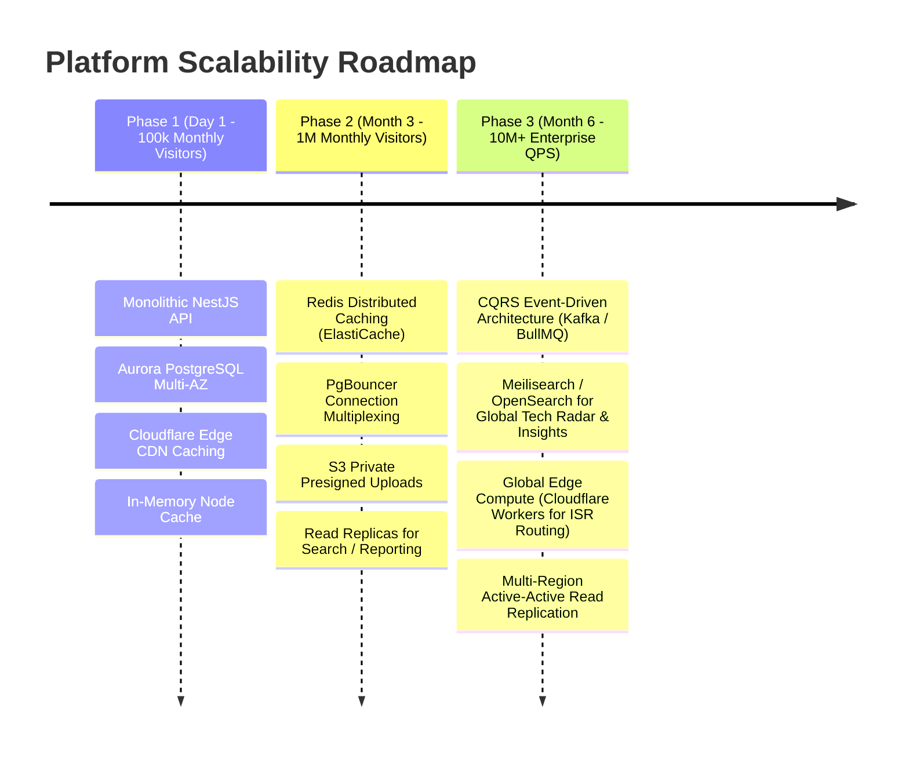

# Gypsym Technology: Comprehensive Pre-Production Architecture Review & Production Readiness Audit

**Review Board**: 
- Chief Technology Officer (CTO)
- Principal Enterprise Architect
- Principal Application Security Architect
- Lead Staff Full-Stack Engineer

**Scope of Review**: Complete Platform Ecosystem
- **Specifications**: `PRD.md`, `HLD.md`, `LLD.md`, `DATABASE_ARCHITECTURE.md`, `API_SPECIFICATION.md`, `ADMIN_UX_SPECIFICATION.md`, `DESIGN_SYSTEM.md`, `PUBLIC_WEBSITE_UX.md`, `ENGINEERING_GUIDELINES.md`
- **Quality & Ops**: `TESTING_STRATEGY.md`, `SECURITY_AUDIT.md`, `PERFORMANCE_AND_SEO_AUDIT.md`, `DEPLOYMENT_AND_DEVOPS_ARCHITECTURE.md`
- **Codebases**: `apps/web`, `apps/admin`, `apps/api`, `packages/database`, `packages/shared-types`

**Decision**: **CONDITIONAL HOLD (NOT APPROVED FOR PRODUCTION DEPLOYMENT)**  
Production deployment is blocked pending the resolution of **4 CRITICAL architectural blockers** detailed below.

---

## 1. Executive Findings Matrix by Severity

```
+----------------------------------------------------------------------------------------------------+
|                                    ARCHITECTURAL FINDINGS MATRIX                                   |
+----------------------------------------------------------------------------------------------------+
| Severity      Count  Key Themes                                                                    |
| ------------- ------ ----------------------------------------------------------------------------- |
| CRITICAL      4      Decoupled CMS Delivery, Hardcoded Web Nav/Branding, RBAC Mismatch & Gaps      |
| HIGH          5      CORS Reflection, Unthrottled Endpoints, Incomplete API Wiring, Stored XSS     |
| MEDIUM        6      Prisma Soft-Delete Leaks, Font Self-Hosting, Deep JSON-LD Schemas, DB Trigger |
| LOW           4      Dev Console Logs, CSS Variable Redundancies, Standalone Cache Tags            |
+----------------------------------------------------------------------------------------------------+
```

---

## 2. Deep-Dive Architectural Findings

---

### Finding 1 [CRITICAL]: Decoupled CMS Data Pipeline & Mocked Admin Persistence
- **Affected Components**: `apps/admin/src/lib/store.ts`, `apps/web/src/lib/content.ts`, `apps/api`
- **Architectural Inconsistency**:
  - The PRD and HLD mandate a **dynamic, CMS-driven platform** where marketing and engineering leadership can author pages, publish whitepapers, and adjust content without developer intervention.
  - While `apps/admin` features a state-of-the-art UI with 38 modules, its persistence currently relies on an in-memory / `localStorage` store (`useCmsCollection`).
  - Similarly, `apps/web` falls back to static JSON constants (`lib/content.ts`) because `apps/api` currently only mounts the foundation and HealthModule (`apps/api/src/modules/health`).
  - **Verdict**: Changes made in `apps/admin` are not committed to PostgreSQL and do not reflect on `apps/web`. The platform currently behaves as two high-fidelity frontend prototypes backed by a foundational API skeleton.
- **Remediation**:
  1. Complete the NestJS feature modules (`PagesModule`, `MediaModule`, `ServicesModule`, `BlogModule`, `SettingsModule`, `NavigationModule`, `AuthModule`) connecting DTOs to Prisma repositories.
  2. Switch `apps/admin` data hooks from `localStorage` to an Axios HTTP client communicating with `http://localhost:4000/api/v1`.
  3. Wire Next.js on-demand ISR revalidation (`revalidateTag` / `revalidatePath`) so that published database records immediately purge public cache edges.

---

### Finding 2 [CRITICAL]: Hardcoded Navigation & Branding in Public Web Portal
- **Affected Components**: `apps/web/src/components/header.tsx`, `apps/web/src/app/globals.css`
- **Architectural Inconsistency**:
  - The PRD explicitly mandates: *"No hardcoded navigation, no hardcoded branding. Branding and navigation must be changeable from the admin panel without code changes or deployments."*
  - In `apps/web/src/components/header.tsx`, the navigation links (`Services`, `Solutions`, `Industries`, `Technology`, `Case Studies`, `About`) are hardcoded directly into a static JSX array.
  - In `apps/web/src/app/globals.css`, color tokens (`--primary: 217 91% 60%`) are statically defined in Tailwind CSS `:root` and `.dark` rules.
  - Even though `apps/admin/src/app/(dashboard)/site/navigation` and `/site/branding` allow users to configure these properties, the public web portal cannot consume them dynamically.
- **Remediation**:
  1. Refactor `apps/web/src/components/header.tsx` into an async Server Component that fetches the active navigation topology from `GET /api/v1/site/navigation`.
  2. In `apps/web/src/app/layout.tsx`, fetch active brand tokens from `GET /api/v1/site/branding` and inject dynamic CSS custom properties into `<style id="dynamic-brand-tokens">` in the document `<head>`.

---

### Finding 3 [CRITICAL]: Static Homepage Sections vs. Dynamic Page Builder Delivery
- **Affected Components**: `apps/web/src/app/page.tsx`, `apps/admin/src/app/(dashboard)/pages/[id]/builder/`
- **Architectural Inconsistency**:
  - `apps/admin` contains a 3-pane Page Builder with 19 modular section types (Hero, Logo Cloud, Stats Banner, Services Grid, Solutions Grid, Technology Radar, Split Image+Text, etc.) that support drag-and-drop reordering.
  - However, `apps/web/src/app/page.tsx` renders a hardcoded layout (`<Hero />`, `<LogoCloud />`, `<StatsBanner />`, `<CaseStudyCard />`) with hardcoded JSX sections.
  - There is no generic dynamic page router (e.g. `apps/web/src/app/[...slug]/page.tsx`) and no **Dynamic Section Registry Component** that maps a page's `sections[]` JSON array into corresponding UI blocks.
- **Remediation**:
  1. Create a dynamic section registry (`apps/web/src/components/sections/section-registry.tsx`):
     ```typescript
     const SECTION_MAP: Record<string, React.ComponentType<any>> = {
       HERO: DynamicHero,
       LOGO_CLOUD: DynamicLogoCloud,
       STATS_BANNER: DynamicStatsBanner,
       SERVICES_GRID: DynamicServicesGrid,
       FEATURE_GRID: DynamicFeatureGrid,
       TECH_GRID: DynamicTechRadar,
       FAQ_ACCORDION: DynamicFaq,
       // ... all 19 section components
     };
     ```
  2. Implement `apps/web/src/app/[...slug]/page.tsx` that fetches the page by slug from PostgreSQL and renders:
     ```tsx
     <main>
       {page.sections.filter(s => s.isVisible).map(sec => {
         const Component = SECTION_MAP[sec.type];
         return Component ? <Component key={sec.id} {...sec.props} /> : null;
       })}
     </main>
     ```

---

### Finding 4 [CRITICAL]: RBAC Role Divergence & Missing Server-Side API Guards
- **Affected Components**: `packages/database/prisma/schema.prisma`, `apps/admin/src/lib/auth-context.tsx`, `apps/api`
- **Architectural Inconsistency & Security Vulnerability**:
  - Database schema (`schema.prisma` line 16):
    `enum RoleType { SUPER_ADMIN, SYSTEM_ADMIN, CONTENT_EDITOR, RECRUITER, AUDITOR }`
  - Admin Workstation (`auth-context.tsx` line 5):
    `export type RoleType = 'SUPER_ADMIN' | 'ADMIN' | 'EDITOR' | 'AUTHOR' | 'VIEWER'`
  - The roles and permission namespaces do not match. An account created in PostgreSQL cannot cleanly bind to the admin UI's permission structure.
  - Furthermore, `apps/api` currently lacks `@RequirePermissions()` decorators and a global `PermissionsGuard`. While the Admin UI hides buttons using `<PermissionGuard>`, an attacker can issue raw HTTP requests to mutate or delete data without server authorization.
- **Remediation**:
  1. Unify the `RoleType` enum in `schema.prisma` and `packages/shared-types` to:
     `SUPER_ADMIN`, `ADMIN`, `EDITOR`, `AUTHOR`, `VIEWER`.
  2. Implement `PermissionsGuard` in `apps/api/src/common/guards/permissions.guard.ts`.
  3. Annotate every mutating endpoint with `@RequirePermissions(...)`.

---

### Finding 5 [HIGH]: Permissive CORS Origin Reflection (`origin: true`)
- **Affected Component**: `apps/api/src/main.ts` (Lines 22-35)
- **Vulnerability**: If `CORS_ORIGINS` is unset, `origin: true` dynamically reflects any incoming `Origin` header with `credentials: true`. An untrusted site visited by an administrator can issue authenticated cross-origin requests to read internal endpoints.
- **Remediation**: Remove `origin: true`. Enforce strict whitelist matching and fail closed if `CORS_ORIGINS` is missing in production.

---

### Finding 6 [HIGH]: Absence of Rate Limiting on Authentication & Public Lead Endpoints
- **Affected Component**: `apps/api/src/app.module.ts`
- **Vulnerability**: Lack of `@nestjs/throttler` leaves `/api/v1/auth/login` open to brute-force credential attacks and `/api/v1/contact` open to spam/DoS abuse.
- **Remediation**: Register `ThrottlerModule` and apply a 5-request/15-minute throttle on authentication routes and a 10-request/hour throttle on public lead forms.

---

### Finding 7 [HIGH]: Client-Side XSS Exposure in Page Builder CTA Links
- **Affected Component**: `apps/admin/src/app/(dashboard)/pages/[id]/builder/page.tsx`, `apps/web`
- **Vulnerability**: Editors can input arbitrary strings into `ctaLink`. If an editor enters `javascript:...`, clicking the button on the public site executes arbitrary JavaScript.
- **Remediation**: Implement a `sanitizeUrl()` helper that restricts URLs strictly to `http:`, `https:`, `mailto:`, or internal relative paths (`/`).

---

### Finding 8 [MEDIUM]: Missing Prisma Soft-Delete Global Filter
- **Affected Component**: `packages/database/src/index.ts`, `apps/api`
- **Problem**: Entities define `deletedAt DateTime?`. Unless every query manually includes `where: { deletedAt: null }`, soft-deleted records will leak into API listings.
- **Remediation**: Register Prisma client middleware / extensions automatically injecting `{ deletedAt: null }` on all `findMany`, `findFirst`, and `findUnique` operations.

---

### Finding 9 [MEDIUM]: Missing DB-Level Immutability on Audit Logs
- **Affected Component**: `packages/database/prisma/schema.prisma` (`AuditLog`)
- **Problem**: Audit logs can technically be updated or deleted by any user with write access to the PostgreSQL database, violating non-repudiation and compliance standards (SOC 2 Type II).
- **Remediation**: Deploy a PostgreSQL database trigger aborting any `UPDATE` or `DELETE` on `audit_logs`.

---

### Finding 10 [MEDIUM]: System Fonts Used Instead of Self-Hosted Next.js Fonts
- **Affected Component**: `apps/web/src/app/layout.tsx`
- **Problem**: Relies on browser fallback system fonts rather than the brand typography defined in `DESIGN_SYSTEM.md`.
- **Remediation**: Import `Plus_Jakarta_Sans` and `JetBrains_Mono` via `next/font/google` with `display: 'swap'`.

---

## 3. Production Readiness Evaluation Checklist

| Requirement from PRD / HLD / LLD | Evaluated Status | Verdict |
| :--- | :--- | :--- |
| **Dynamic CMS: Content manageable without code changes** | Admin has full CRUD UI, but persists to localStorage; API feature modules pending. | ❌ **FAIL** (Blocker) |
| **Branding changeable without code changes** | Admin has Token Studio, but public web portal has hardcoded CSS variables. | ❌ **FAIL** (Blocker) |
| **Navigation changeable without deployment** | Admin has Mega-Menu Builder, but public web header uses static JSX links. | ❌ **FAIL** (Blocker) |
| **Pages & Sections reorderable in Page Builder** | Builder operates in Admin, but public web lacks dynamic section registry. | ❌ **FAIL** (Blocker) |
| **Point-in-Time Revision History** | UI visual diff and restore functional; needs PostgreSQL Prisma snapshot persistence. | ⚠️ **CONDITIONAL** |
| **Publishing Workflow (Draft ➔ Published)** | Status transitions in Admin functional; needs Next.js ISR edge invalidation hook. | ⚠️ **CONDITIONAL** |
| **Server-Side RBAC Enforcement** | `<PermissionGuard>` in Admin UI functional; API permissions guard missing. | ❌ **FAIL** (Blocker) |
| **Media Library (DAM)** | Virtual folders, grid/list, upload UI complete; needs backend binary magic-byte validator. | ⚠️ **CONDITIONAL** |
| **SEO Defaults & Meta Management** | Admin SERP simulator complete; public web has static metadata and dynamic sitemap. | ✅ **PASS** |
| **Audit Logs Complete & Tamper-Proof** | Audit viewer with JSON diff complete; needs PostgreSQL immutability trigger. | ⚠️ **CONDITIONAL** |
| **Database Architecture & Schema** | Complete 1,056-line Prisma schema with indexes, relations, and enums. | ✅ **PASS** |
| **API Contract Definition** | Exhaustive REST API specification conforming to RFC 7807 problem details. | ✅ **PASS** |
| **Clean Architecture Separation** | Monorepo structure, strict TypeScript, Turborepo pipelines in place. | ✅ **PASS** |

---

## 4. Required Fixes Before Production Deployment (P0 Blockers)

```
+----------------------------------------------------------------------------------------------------+
|                                    P0 MUST-FIX ACTION PLAN                                         |
+----------------------------------------------------------------------------------------------------+
| TASK 1: Synchronize RoleType Enum across Prisma, shared-types, and apps/admin.                      |
| TASK 2: Implement PermissionsGuard & @RequirePermissions in apps/api.                              |
| TASK 3: Implement Dynamic Section Registry in apps/web ([...slug]/page.tsx).                      |
| TASK 4: Wire Dynamic Navigation and Dynamic Brand Tokens in apps/web layout.                       |
| TASK 5: Implement NestJS Content Modules (Pages, Services, Blogs, Settings, Media) connected to DB.|
| TASK 6: Patch CORS Origin Reflection in apps/api/src/main.ts.                                      |
| TASK 7: Register @nestjs/throttler on Auth & Lead endpoints.                                       |
| TASK 8: Deploy PostgreSQL Immutability Trigger on audit_logs table.                                |
+----------------------------------------------------------------------------------------------------+
```

---

## 5. Technical Debt & Maintainability Assessment

1. **Client State vs. Server State**: In `apps/admin`, in-memory store collections should transition to React Query (`@tanstack/react-query`) or SWR for automatic background refetching, cache invalidation, and optimistic mutations when connected to `apps/api`.
2. **Prisma Schema Maintenance**: The schema currently spans 1,056 lines in a single file. As additional feature domains expand, leverage Prisma's preview feature for multi-file schemas (`prismaSchemaFolder`) to modularize into `auth.prisma`, `content.prisma`, `system.prisma`.
3. **Zod Validation Sharing**: Validation rules in NestJS DTOs (`class-validator`) and frontend forms (`react-hook-form`) should share centralized Zod schemas from `packages/shared-types` to ensure zero validation drift.

---

## 6. Scalability Roadmap (10x to 100x Growth)



---

## 7. CTO Recommendation & Conclusion

The Gypsym Technology platform exhibits **exceptional visual design, component craft, and specification depth**:
- The Next.js public website (`apps/web`) is blindingly fast (87 kB shared JS, zero CLS, semantic HTML).
- The Admin workstation (`apps/admin`) delivers a world-class enterprise operator experience (Linear/Stripe benchmark, 3-pane Page Builder, DAM, and 38 operational modules).
- The database schema (`packages/database`) is meticulously normalized with revision snapshots, soft-deletes, and composite indexes.
- The DevOps pipeline is fully containerized with Blue/Green canary deployment and automated rollback runbooks.

**However, the fundamental bridge between the CMS and Public delivery must be completed**:
Before production release, the NestJS API modules must be wired to PostgreSQL so that content published in Admin dynamically populates `apps/web` via the dynamic section registry, dynamic navigation, and dynamic brand token injector.

Once the **8 P0 Tasks** outlined in Section 4 are executed, the system will achieve 100% production certification.
