# Gypsym Technology: Database Architecture Specification
## Document Version: 1.0.0-DB-SPEC
### Baseline: PRD.md v1.0.0 | HLD.md v1.0.0 | LLD.md v1.0.0
### Primary Technologies: PostgreSQL 16 Enterprise | Prisma ORM 5.x

---

## 1. Architectural Principles & Schema Standards

1. **Normalization vs. Controlled Denormalization:** 
   * Strict 3NF normalization for transactional and relational entities (Users, Permissions, Taxonomy, Clients, Navigation).
   * Controlled denormalization only where extreme performance is required without N+1 query overhead (e.g., storing calculated `read_time_minutes` on `blog_posts`, pre-aggregated file metadata on `media`, and caching primary SEO metadata keys).
2. **JSON Discipline:** 
   * Anti-Pattern Avoided: Storing arbitrary bags of untyped JSON across business entities.
   * Controlled Usage: JSON (`Json` / `JSONB`) is restricted to dynamic UI section builder payloads (`PageSection.content_payload`), configurable responsive styles, polymorphic structured data (`SeoMetadata.structured_data`), and immutable audit delta snapshots (`AuditLog.diff_snapshot`). Every JSON column has an explicit schema contract.
3. **Primary Key & Identity Strategy:**
   * UUIDv4/UUIDv7 (`@id @default(uuid()) @db.Uuid`) across all primary keys to guarantee distributed uniqueness, prevent sequential ID enumeration attacks, and simplify multi-region data replication.
4. **Soft Deletion & Uniqueness Preservation:**
   * Content tables implement `deleted_at DateTime? @map("deleted_at")`.
   * Natural unique keys (such as `slug` and `email`) utilize compound unique indexes with `deleted_at` (e.g., `@@unique([slug, deletedAt])`) to allow re-registration of slugs or emails after records are deleted.
5. **Localization Readiness (i18n):**
   * Translatable content entities feature a `locale` column (ISO 639-1 / BCP 47: `en`, `de`, `fr`, `ja`, etc.) with default `'en'`, enabling compound indexes `@@unique([slug, locale, deletedAt])`.
6. **Publishing Lifecycle State Machine:**
   * Centralized `ContentStatus` enum: `DRAFT`, `SCHEDULED`, `PUBLISHED`, `ARCHIVED`, `TRASHED`.
   * Dedicated temporal markers: `published_at` and `scheduled_at`.
7. **Referential Integrity:**
   * Explicit foreign keys with deterministic cascading: `onDelete: Cascade` for owned child collections (e.g., `PageSection`, `NavigationItem`), and `onDelete: Restrict` or `onDelete: SetNull` for shared referential assets (e.g., `Media`, `User`, `Category`).

---

## 2. Table-by-Table Data Dictionary

Below is the exhaustive specification of all tables across the Gypsym Technology platform.

---

### Domain 1: Identity, Access Management & Governance

#### Table: `users`
* **Purpose:** System administrators, content editors, recruiters, and platform operators.
* **Columns:**
  * `id` (`UUID`, PK, Not Null): Unique user identifier.
  * `email` (`VARCHAR(255)`, Not Null): User login email.
  * `password_hash` (`VARCHAR(255)`, Not Null): Argon2id password hash.
  * `first_name` (`VARCHAR(100)`, Not Null): Given name.
  * `last_name` (`VARCHAR(100)`, Not Null): Family name.
  * `is_active` (`BOOLEAN`, Not Null, Default: `true`): Account active status.
  * `is_2fa_enabled` (`BOOLEAN`, Not Null, Default: `false`): TOTP two-factor authentication flag.
  * `two_factor_secret` (`VARCHAR(255)`, Nullable): Encrypted base32 TOTP secret.
  * `two_factor_backup_codes` (`VARCHAR(255)[]`, Nullable): Array of hashed backup recovery codes.
  * `last_login_at` (`TIMESTAMPTZ`, Nullable): Timestamp of last authenticated session.
  * `created_at` (`TIMESTAMPTZ`, Not Null, Default: `NOW()`): Record creation timestamp.
  * `updated_at` (`TIMESTAMPTZ`, Not Null): Record update timestamp.
  * `deleted_at` (`TIMESTAMPTZ`, Nullable): Soft delete marker.
* **Constraints & Indexes:**
  * PK: `id`
  * Unique: `[email, deleted_at]`
  * Index: `is_active`, `created_at`
* **Relationships:** 1:N with `user_roles`, 1:N with `sessions`, 1:N with `audit_logs`, 1:N with `blog_posts` (author).

#### Table: `roles`
* **Purpose:** System roles defining access boundaries.
* **Columns:**
  * `id` (`UUID`, PK, Not Null): Role identifier.
  * `key` (`VARCHAR(50)`, Not Null): Enum/String key (`SUPER_ADMIN`, `SYSTEM_ADMIN`, `CONTENT_EDITOR`, `RECRUITER`, `AUDITOR`).
  * `name` (`VARCHAR(100)`, Not Null): Human-readable role name.
  * `description` (`TEXT`, Nullable): Detailed scope description.
  * `is_system` (`BOOLEAN`, Not Null, Default: `true`): Prevents deletion of core roles.
  * `created_at` (`TIMESTAMPTZ`, Not Null, Default: `NOW()`): Timestamp.
  * `updated_at` (`TIMESTAMPTZ`, Not Null): Timestamp.
* **Constraints & Indexes:**
  * PK: `id`
  * Unique: `key`
* **Relationships:** 1:N with `user_roles`, 1:N with `role_permissions`.

#### Table: `permissions`
* **Purpose:** Atomic security capabilities.
* **Columns:**
  * `id` (`UUID`, PK, Not Null): Permission identifier.
  * `key` (`VARCHAR(100)`, Not Null): Unique permission token (e.g., `pages:publish`, `media:delete`, `users:manage`).
  * `module` (`VARCHAR(50)`, Not Null): Domain module grouping (`PAGES`, `BLOG`, `MEDIA`, `IAM`, `SETTINGS`).
  * `description` (`VARCHAR(255)`, Nullable): Explanation of capability.
* **Constraints & Indexes:**
  * PK: `id`
  * Unique: `key`
  * Index: `module`
* **Relationships:** 1:N with `role_permissions`.

#### Table: `user_roles`
* **Purpose:** Explicit join table mapping users to roles (supports multi-role assignment).
* **Columns:**
  * `id` (`UUID`, PK, Not Null): Join record ID.
  * `user_id` (`UUID`, Not Null, FK → `users.id` ON DELETE CASCADE).
  * `role_id` (`UUID`, Not Null, FK → `roles.id` ON DELETE CASCADE).
  * `assigned_at` (`TIMESTAMPTZ`, Not Null, Default: `NOW()`).
* **Constraints & Indexes:**
  * PK: `id`
  * Unique: `[user_id, role_id]`
  * Index: `role_id`

#### Table: `role_permissions`
* **Purpose:** Explicit join table mapping roles to atomic permissions.
* **Columns:**
  * `id` (`UUID`, PK, Not Null): Join record ID.
  * `role_id` (`UUID`, Not Null, FK → `roles.id` ON DELETE CASCADE).
  * `permission_id` (`UUID`, Not Null, FK → `permissions.id` ON DELETE CASCADE).
  * `granted_at` (`TIMESTAMPTZ`, Not Null, Default: `NOW()`).
* **Constraints & Indexes:**
  * PK: `id`
  * Unique: `[role_id, permission_id]`
  * Index: `permission_id`

#### Table: `sessions`
* **Purpose:** Tracks active refresh token families for sliding session expiration and reuse detection.
* **Columns:**
  * `id` (`UUID`, PK, Not Null): Session identifier.
  * `user_id` (`UUID`, Not Null, FK → `users.id` ON DELETE CASCADE).
  * `token_hash` (`VARCHAR(255)`, Not Null): Hashed refresh token (SHA-256).
  * `jti` (`UUID`, Not Null): JWT ID unique token identifier.
  * `family_id` (`UUID`, Not Null): Token family grouping for rotation reuse detection.
  * `ip_address` (`VARCHAR(45)`, Nullable): Client IP (IPv4 or IPv6).
  * `user_agent` (`TEXT`, Nullable): Client browser user agent.
  * `is_revoked` (`BOOLEAN`, Not Null, Default: `false`).
  * `expires_at` (`TIMESTAMPTZ`, Not Null): Session expiry date.
  * `created_at` (`TIMESTAMPTZ`, Not Null, Default: `NOW()`).
  * `updated_at` (`TIMESTAMPTZ`, Not Null).
* **Constraints & Indexes:**
  * PK: `id`
  * Unique: `token_hash`, `jti`
  * Index: `user_id`, `family_id`, `expires_at`, `is_revoked`

---

### Domain 2: Platform Settings & Global Navigation

#### Table: `site_settings`
* **Purpose:** System-wide operational key-value configuration.
* **Columns:**
  * `id` (`UUID`, PK, Not Null): Setting ID.
  * `category` (`VARCHAR(50)`, Not Null): `GENERAL`, `CONTACT`, `SECURITY`, `ANALYTICS`, `INTEGRATIONS`.
  * `key` (`VARCHAR(100)`, Not Null): Unique setting key.
  * `value` (`JSONB`, Not Null): Strongly typed JSON configuration payload.
  * `is_public` (`BOOLEAN`, Not Null, Default: `false`): Publicly exposed via API.
  * `updated_by` (`UUID`, Nullable, FK → `users.id` ON DELETE SET NULL).
  * `created_at` (`TIMESTAMPTZ`, Not Null, Default: `NOW()`).
  * `updated_at` (`TIMESTAMPTZ`, Not Null).
* **Constraints & Indexes:**
  * PK: `id`
  * Unique: `key`
  * Index: `[category, is_public]`

#### Table: `brand_settings`
* **Purpose:** Dynamic brand styling, logos, color tokens, and typography configuration.
* **Columns:**
  * `id` (`UUID`, PK, Not Null): Brand configuration record ID.
  * `version` (`INT`, Not Null, Default: `1`): Monotonically increasing version.
  * `is_active` (`BOOLEAN`, Not Null, Default: `true`): Active brand profile flag.
  * `company_name` (`VARCHAR(150)`, Not Null): Corporate legal/DBA name.
  * `logo_light_id` (`UUID`, Nullable, FK → `media.id` ON DELETE SET NULL): Primary light logo.
  * `logo_dark_id` (`UUID`, Nullable, FK → `media.id` ON DELETE SET NULL): Primary dark logo.
  * `favicon_id` (`UUID`, Nullable, FK → `media.id` ON DELETE SET NULL): Browser favicon.
  * `apple_touch_icon_id` (`UUID`, Nullable, FK → `media.id` ON DELETE SET NULL): Mobile icon.
  * `colors` (`JSONB`, Not Null): Structured HSL/HEX color tokens.
  * `typography` (`JSONB`, Not Null): Font families, weights, and scale ratios.
  * `social_links` (`JSONB`, Not Null): Array of `{ platform, url, icon, isActive }`.
  * `updated_by` (`UUID`, Nullable, FK → `users.id` ON DELETE SET NULL).
  * `created_at` (`TIMESTAMPTZ`, Not Null, Default: `NOW()`).
  * `updated_at` (`TIMESTAMPTZ`, Not Null).
* **Constraints & Indexes:**
  * PK: `id`
  * Partial Unique: `is_active` WHERE `is_active = true` (only one active brand configuration permitted).

#### Table: `navigations`
* **Purpose:** Root navigation containers (e.g., Primary Header, Footer Column 1, Legal Bar).
* **Columns:**
  * `id` (`UUID`, PK, Not Null): Navigation ID.
  * `key` (`VARCHAR(50)`, Not Null): System location key (`HEADER_PRIMARY`, `FOOTER_COL_1`, `FOOTER_COL_2`, `FOOTER_LEGAL`).
  * `title` (`VARCHAR(100)`, Not Null): Administrative label.
  * `is_active` (`BOOLEAN`, Not Null, Default: `true`).
  * `created_at` (`TIMESTAMPTZ`, Not Null, Default: `NOW()`).
  * `updated_at` (`TIMESTAMPTZ`, Not Null).
* **Constraints & Indexes:**
  * PK: `id`
  * Unique: `key`
* **Relationships:** 1:N with `navigation_items`.

#### Table: `navigation_items`
* **Purpose:** Hierarchical menu links and mega-menu dropdowns.
* **Columns:**
  * `id` (`UUID`, PK, Not Null): Item ID.
  * `navigation_id` (`UUID`, Not Null, FK → `navigations.id` ON DELETE CASCADE).
  * `parent_id` (`UUID`, Nullable, FK → `navigation_items.id` ON DELETE CASCADE): Self-referential nesting.
  * `label` (`VARCHAR(100)`, Not Null): Display text.
  * `url` (`VARCHAR(500)`, Not Null): Target path or external link.
  * `icon` (`VARCHAR(50)`, Nullable): Lucide icon identifier.
  * `badge_text` (`VARCHAR(30)`, Nullable): Optional tag (e.g., "New", "Beta").
  * `is_external` (`BOOLEAN`, Not Null, Default: `false`).
  * `display_order` (`INT`, Not Null, Default: `0`): Visual sort order.
  * `mega_menu_config` (`JSONB`, Nullable): Configuration for multi-column mega-menus with promo cards.
  * `is_active` (`BOOLEAN`, Not Null, Default: `true`).
* **Constraints & Indexes:**
  * PK: `id`
  * Index: `[navigation_id, parent_id, display_order]`

---

### Domain 3: Dynamic Pages, Page Sections & Revisions

#### Table: `pages`
* **Purpose:** Dynamic URL routes and landing page layouts.
* **Columns:**
  * `id` (`UUID`, PK, Not Null): Page ID.
  * `slug` (`VARCHAR(200)`, Not Null): URL route slug.
  * `title` (`VARCHAR(200)`, Not Null): Page title.
  * `description` (`TEXT`, Nullable): Summary description.
  * `layout_type` (`VARCHAR(50)`, Not Null, Default: `'DEFAULT'`): `DEFAULT`, `FULL_WIDTH`, `LANDING`, `MINIMAL`.
  * `status` (`VARCHAR(20)`, Not Null, Default: `'DRAFT'`): Enum: `DRAFT`, `SCHEDULED`, `PUBLISHED`, `ARCHIVED`, `TRASHED`.
  * `locale` (`VARCHAR(10)`, Not Null, Default: `'en'`): BCP 47 locale code.
  * `published_at` (`TIMESTAMPTZ`, Nullable): Timestamp when content went live.
  * `scheduled_at` (`TIMESTAMPTZ`, Nullable): Timestamp for automated publication.
  * `created_at` (`TIMESTAMPTZ`, Not Null, Default: `NOW()`).
  * `updated_at` (`TIMESTAMPTZ`, Not Null).
  * `deleted_at` (`TIMESTAMPTZ`, Nullable): Soft deletion marker.
* **Constraints & Indexes:**
  * PK: `id`
  * Unique: `[slug, locale, deleted_at]`
  * Index: `[status, published_at]`, `deleted_at`
* **Relationships:** 1:N with `page_sections`, 1:N with `page_revisions`, 1:1 with `seo_metadata`.

#### Table: `page_sections`
* **Purpose:** Ordered, configurable component sections composing a page.
* **Columns:**
  * `id` (`UUID`, PK, Not Null): Section ID.
  * `page_id` (`UUID`, Not Null, FK → `pages.id` ON DELETE CASCADE).
  * `section_identifier` (`VARCHAR(100)`, Not Null): Anchor or admin identifier (e.g., `hero-main`, `cloud-features`).
  * `component_type` (`VARCHAR(50)`, Not Null): `HERO`, `FEATURE_GRID`, `METRICS_BANNER`, `CTA_STRIP`, `LOGO_CLOUD`, `TESTIMONIAL_SLIDER`, `ACCORDION_FAQ`, `CUSTOM_HTML`.
  * `display_order` (`INT`, Not Null, Default: `0`): Section vertical order.
  * `content_payload` (`JSONB`, Not Null): Section data strictly adhering to component JSON schema.
  * `styles_override` (`JSONB`, Nullable): Spacing, background colors, custom paddings.
  * `is_active` (`BOOLEAN`, Not Null, Default: `true`).
  * `created_at` (`TIMESTAMPTZ`, Not Null, Default: `NOW()`).
  * `updated_at` (`TIMESTAMPTZ`, Not Null).
* **Constraints & Indexes:**
  * PK: `id`
  * Index: `[page_id, display_order]`

#### Table: `page_revisions`
* **Purpose:** Point-in-time snapshot history for visual diffs and 1-click rollback.
* **Columns:**
  * `id` (`UUID`, PK, Not Null): Revision ID.
  * `page_id` (`UUID`, Not Null, FK → `pages.id` ON DELETE CASCADE).
  * `version_num` (`INT`, Not Null): Sequential version counter.
  * `snapshot` (`JSONB`, Not Null): Complete serialized snapshot of the Page and all its PageSections.
  * `change_notes` (`TEXT`, Nullable): Author's description of modifications.
  * `created_by` (`UUID`, Not Null, FK → `users.id` ON DELETE RESTRICT).
  * `created_at` (`TIMESTAMPTZ`, Not Null, Default: `NOW()`).
* **Constraints & Indexes:**
  * PK: `id`
  * Unique: `[page_id, version_num]`
  * Index: `[page_id, created_at]`

---

### Domain 4: Digital Asset Management (DAM)

#### Table: `media_folders`
* **Purpose:** Hierarchical virtual folder organization for assets.
* **Columns:**
  * `id` (`UUID`, PK, Not Null): Folder ID.
  * `name` (`VARCHAR(100)`, Not Null): Folder display name.
  * `slug` (`VARCHAR(100)`, Not Null): URL/Path-safe slug.
  * `parent_id` (`UUID`, Nullable, FK → `media_folders.id` ON DELETE CASCADE): Self-referential parent.
  * `created_at` (`TIMESTAMPTZ`, Not Null, Default: `NOW()`).
  * `updated_at` (`TIMESTAMPTZ`, Not Null).
* **Constraints & Indexes:**
  * PK: `id`
  * Unique: `[parent_id, slug]`
* **Relationships:** 1:N with `media`.

#### Table: `media`
* **Purpose:** Core asset registry tracking files, dimensions, variants, and S3 storage keys.
* **Columns:**
  * `id` (`UUID`, PK, Not Null): Media asset ID.
  * `folder_id` (`UUID`, Nullable, FK → `media_folders.id` ON DELETE SET NULL).
  * `original_filename` (`VARCHAR(255)`, Not Null): Original uploaded file name.
  * `storage_key` (`VARCHAR(500)`, Not Null): Cloud storage S3/R2 unique path key.
  * `mime_type` (`VARCHAR(100)`, Not Null): Media MIME type (`image/png`, `image/webp`, `application/pdf`).
  * `file_size_bytes` (`BIGINT`, Not Null): Byte size.
  * `width` (`INT`, Nullable): Image/video pixel width.
  * `height` (`INT`, Nullable): Image/video pixel height.
  * `aspect_ratio` (`NUMERIC(5,2)`, Nullable): Calculated aspect ratio.
  * `alt_text` (`VARCHAR(255)`, Nullable): Screen-reader alternative text.
  * `caption` (`TEXT`, Nullable): Editorial caption.
  * `dominant_color` (`VARCHAR(10)`, Nullable): Extracted HEX color code for blur-up loading.
  * `variants` (`JSONB`, Nullable): Pre-transcoded responsive variants `{ thumb, sm, md, lg, avif, webp }`.
  * `status` (`VARCHAR(20)`, Not Null, Default: `'PENDING'`): `PENDING`, `PROCESSING`, `READY`, `FAILED`.
  * `uploaded_by` (`UUID`, Nullable, FK → `users.id` ON DELETE SET NULL).
  * `created_at` (`TIMESTAMPTZ`, Not Null, Default: `NOW()`).
  * `updated_at` (`TIMESTAMPTZ`, Not Null).
  * `deleted_at` (`TIMESTAMPTZ`, Nullable): Soft deletion marker.
* **Constraints & Indexes:**
  * PK: `id`
  * Unique: `storage_key`
  * Index: `folder_id`, `mime_type`, `status`, `deleted_at`

---

### Domain 5: Solutions, Commercial Portfolio & Technology

#### Table: `services`
* **Purpose:** Enterprise technology services (e.g., Cloud Architecture, AI Transformation).
* **Columns:**
  * `id` (`UUID`, PK, Not Null): Service ID.
  * `slug` (`VARCHAR(150)`, Not Null): URL slug.
  * `title` (`VARCHAR(150)`, Not Null): Service title.
  * `tagline` (`VARCHAR(255)`, Nullable): Brief promotional headline.
  * `short_description` (`TEXT`, Not Null): Summary card description.
  * `detailed_content` (`TEXT`, Nullable): Markdown or structured rich text.
  * `icon_id` (`UUID`, Nullable, FK → `media.id` ON DELETE SET NULL): Service icon asset.
  * `featured_image_id` (`UUID`, Nullable, FK → `media.id` ON DELETE SET NULL): Cover media asset.
  * `display_order` (`INT`, Not Null, Default: `0`): Sort order.
  * `parent_service_id` (`UUID`, Nullable, FK → `services.id` ON DELETE SET NULL): Hierarchical capability tree.
  * `status` (`VARCHAR(20)`, Not Null, Default: `'DRAFT'`): ContentStatus.
  * `locale` (`VARCHAR(10)`, Not Null, Default: `'en'`).
  * `published_at` (`TIMESTAMPTZ`, Nullable).
  * `created_at` (`TIMESTAMPTZ`, Not Null, Default: `NOW()`).
  * `updated_at` (`TIMESTAMPTZ`, Not Null).
  * `deleted_at` (`TIMESTAMPTZ`, Nullable).
* **Constraints & Indexes:**
  * PK: `id`
  * Unique: `[slug, locale, deleted_at]`
  * Index: `[status, display_order]`, `parent_service_id`
* **Relationships:** 1:N with `service_technologies`, 1:N with `service_solutions`, 1:1 with `seo_metadata`.

#### Table: `solutions`
* **Purpose:** Cross-cutting business solutions mapped to enterprise business outcomes.
* **Columns:**
  * `id` (`UUID`, PK, Not Null): Solution ID.
  * `slug` (`VARCHAR(150)`, Not Null): URL slug.
  * `title` (`VARCHAR(150)`, Not Null): Solution name.
  * `summary` (`TEXT`, Not Null): Executive summary.
  * `detailed_content` (`TEXT`, Nullable): Deep technical narrative.
  * `cover_image_id` (`UUID`, Nullable, FK → `media.id` ON DELETE SET NULL).
  * `display_order` (`INT`, Not Null, Default: `0`).
  * `status` (`VARCHAR(20)`, Not Null, Default: `'DRAFT'`).
  * `locale` (`VARCHAR(10)`, Not Null, Default: `'en'`).
  * `published_at` (`TIMESTAMPTZ`, Nullable).
  * `created_at` (`TIMESTAMPTZ`, Not Null, Default: `NOW()`).
  * `updated_at` (`TIMESTAMPTZ`, Not Null).
  * `deleted_at` (`TIMESTAMPTZ`, Nullable).
* **Constraints & Indexes:**
  * PK: `id`
  * Unique: `[slug, locale, deleted_at]`
  * Index: `[status, display_order]`
* **Relationships:** 1:N with `solution_industries`, 1:N with `service_solutions`, 1:1 with `seo_metadata`.

#### Table: `industries`
* **Purpose:** Target market sectors (e.g., FinTech, Healthcare, Public Sector).
* **Columns:**
  * `id` (`UUID`, PK, Not Null): Industry ID.
  * `slug` (`VARCHAR(100)`, Not Null): URL slug.
  * `name` (`VARCHAR(100)`, Not Null): Industry name.
  * `description` (`TEXT`, Nullable): Overview.
  * `icon_id` (`UUID`, Nullable, FK → `media.id` ON DELETE SET NULL).
  * `display_order` (`INT`, Not Null, Default: `0`).
  * `created_at` (`TIMESTAMPTZ`, Not Null, Default: `NOW()`).
  * `updated_at` (`TIMESTAMPTZ`, Not Null).
* **Constraints & Indexes:**
  * PK: `id`
  * Unique: `slug`

#### Table: `technologies`
* **Purpose:** Technology capabilities and toolsets (e.g., Kubernetes, Rust, PyTorch).
* **Columns:**
  * `id` (`UUID`, PK, Not Null): Tech ID.
  * `slug` (`VARCHAR(100)`, Not Null): Slug.
  * `name` (`VARCHAR(100)`, Not Null): Technology name.
  * `category` (`VARCHAR(50)`, Not Null): `CLOUD`, `DATA`, `AI`, `FRONTEND`, `SECURITY`, `DEVOPS`.
  * `icon_id` (`UUID`, Nullable, FK → `media.id` ON DELETE SET NULL).
  * `website_url` (`VARCHAR(500)`, Nullable).
  * `display_order` (`INT`, Not Null, Default: `0`).
* **Constraints & Indexes:**
  * PK: `id`
  * Unique: `slug`
  * Index: `category`

#### Table: `clients`
* **Purpose:** Enterprise client accounts and showcase partners.
* **Columns:**
  * `id` (`UUID`, PK, Not Null): Client ID.
  * `slug` (`VARCHAR(100)`, Not Null): Slug.
  * `name` (`VARCHAR(150)`, Not Null): Corporate name.
  * `logo_light_id` (`UUID`, Not Null, FK → `media.id` ON DELETE RESTRICT): Light logo asset.
  * `logo_dark_id` (`UUID`, Not Null, FK → `media.id` ON DELETE RESTRICT): Dark logo asset.
  * `website_url` (`VARCHAR(500)`, Nullable): Company link.
  * `industry_id` (`UUID`, Nullable, FK → `industries.id` ON DELETE SET NULL).
  * `tier` (`VARCHAR(30)`, Not Null, Default: `'ENTERPRISE'`): `STRATEGIC`, `ENTERPRISE`, `SHOWCASE`.
  * `is_featured` (`BOOLEAN`, Not Null, Default: `false`).
  * `display_order` (`INT`, Not Null, Default: `0`).
  * `created_at` (`TIMESTAMPTZ`, Not Null, Default: `NOW()`).
  * `updated_at` (`TIMESTAMPTZ`, Not Null).
* **Constraints & Indexes:**
  * PK: `id`
  * Unique: `slug`
  * Index: `tier`, `is_featured`
* **Relationships:** 1:N with `case_studies`, 1:N with `testimonials`, 1:N with `projects`.

#### Table: `case_studies`
* **Purpose:** Customer success stories featuring verified transformation metrics.
* **Columns:**
  * `id` (`UUID`, PK, Not Null): Case study ID.
  * `slug` (`VARCHAR(150)`, Not Null): URL slug.
  * `title` (`VARCHAR(200)`, Not Null): Headline.
  * `client_id` (`UUID`, Not Null, FK → `clients.id` ON DELETE RESTRICT).
  * `summary` (`TEXT`, Not Null): Executive summary.
  * `challenge_statement` (`TEXT`, Not Null): Problem narrative.
  * `solution_statement` (`TEXT`, Not Null): Architectural narrative.
  * `impact_metrics` (`JSONB`, Not Null): Array of `{ metric: "+320%", label: "Throughput", description: "..." }`.
  * `cover_image_id` (`UUID`, Not Null, FK → `media.id` ON DELETE RESTRICT).
  * `status` (`VARCHAR(20)`, Not Null, Default: `'DRAFT'`).
  * `locale` (`VARCHAR(10)`, Not Null, Default: `'en'`).
  * `published_at` (`TIMESTAMPTZ`, Nullable).
  * `created_at` (`TIMESTAMPTZ`, Not Null, Default: `NOW()`).
  * `updated_at` (`TIMESTAMPTZ`, Not Null).
  * `deleted_at` (`TIMESTAMPTZ`, Nullable).
* **Constraints & Indexes:**
  * PK: `id`
  * Unique: `[slug, locale, deleted_at]`
  * Index: `client_id`, `[status, published_at]`
* **Relationships:** 1:N with `case_study_technologies`, 1:1 with `seo_metadata`.

#### Table: `projects`
* **Purpose:** Internal innovation projects, R&D initiatives, and open-source software.
* **Columns:**
  * `id` (`UUID`, PK, Not Null): Project ID.
  * `slug` (`VARCHAR(150)`, Not Null): Slug.
  * `title` (`VARCHAR(150)`, Not Null): Project title.
  * `client_id` (`UUID`, Nullable, FK → `clients.id` ON DELETE SET NULL).
  * `description` (`TEXT`, Not Null): Project narrative.
  * `cover_image_id` (`UUID`, Nullable, FK → `media.id` ON DELETE SET NULL).
  * `github_url` (`VARCHAR(500)`, Nullable): Repository link.
  * `demo_url` (`VARCHAR(500)`, Nullable): Live sandbox link.
  * `status` (`VARCHAR(20)`, Not Null, Default: `'PUBLISHED'`).
  * `created_at` (`TIMESTAMPTZ`, Not Null, Default: `NOW()`).
  * `updated_at` (`TIMESTAMPTZ`, Not Null).
* **Constraints & Indexes:**
  * PK: `id`
  * Unique: `slug`

#### Table: `testimonials`
* **Purpose:** Executive customer endorsements.
* **Columns:**
  * `id` (`UUID`, PK, Not Null): Testimonial ID.
  * `client_id` (`UUID`, Nullable, FK → `clients.id` ON DELETE SET NULL).
  * `quote` (`TEXT`, Not Null): Endorsement statement.
  * `author_name` (`VARCHAR(120)`, Not Null): Person's name.
  * `author_title` (`VARCHAR(120)`, Not Null): Executive title (e.g., "VP of Cloud Engineering").
  * `author_company` (`VARCHAR(150)`, Not Null): Organization name.
  * `avatar_id` (`UUID`, Nullable, FK → `media.id` ON DELETE SET NULL).
  * `rating` (`INT`, Not Null, Default: `5`): 1-5 star score.
  * `is_featured` (`BOOLEAN`, Not Null, Default: `false`).
  * `display_order` (`INT`, Not Null, Default: `0`).
  * `created_at` (`TIMESTAMPTZ`, Not Null, Default: `NOW()`).
  * `updated_at` (`TIMESTAMPTZ`, Not Null).
* **Constraints & Indexes:**
  * PK: `id`
  * Index: `is_featured`, `display_order`

---

### Domain 6: Organization, Leadership & Trust

#### Table: `departments`
* **Purpose:** Organizational divisions (e.g., Executive, Distributed Systems, AI Research, Design).
* **Columns:**
  * `id` (`UUID`, PK, Not Null): Department ID.
  * `name` (`VARCHAR(100)`, Not Null): Department name.
  * `slug` (`VARCHAR(100)`, Not Null): Slug.
  * `display_order` (`INT`, Not Null, Default: `0`).
* **Constraints & Indexes:**
  * PK: `id`
  * Unique: `slug`

#### Table: `team_members`
* **Purpose:** Leadership and key engineering contributors.
* **Columns:**
  * `id` (`UUID`, PK, Not Null): Member ID.
  * `slug` (`VARCHAR(100)`, Not Null): Slug.
  * `first_name` (`VARCHAR(80)`, Not Null): Given name.
  * `last_name` (`VARCHAR(80)`, Not Null): Family name.
  * `role_title` (`VARCHAR(120)`, Not Null): Job title.
  * `department_id` (`UUID`, Not Null, FK → `departments.id` ON DELETE RESTRICT).
  * `bio` (`TEXT`, Nullable): Professional summary.
  * `avatar_id` (`UUID`, Nullable, FK → `media.id` ON DELETE SET NULL).
  * `linkedin_url` (`VARCHAR(500)`, Nullable).
  * `twitter_url` (`VARCHAR(500)`, Nullable).
  * `github_url` (`VARCHAR(500)`, Nullable).
  * `is_leadership` (`BOOLEAN`, Not Null, Default: `false`): Highlights on Executive page.
  * `display_order` (`INT`, Not Null, Default: `0`).
  * `is_active` (`BOOLEAN`, Not Null, Default: `true`).
  * `created_at` (`TIMESTAMPTZ`, Not Null, Default: `NOW()`).
  * `updated_at` (`TIMESTAMPTZ`, Not Null).
* **Constraints & Indexes:**
  * PK: `id`
  * Unique: `slug`
  * Index: `department_id`, `is_leadership`, `display_order`

#### Table: `faqs`
* **Purpose:** Frequently asked questions.
* **Columns:**
  * `id` (`UUID`, PK, Not Null): FAQ ID.
  * `category` (`VARCHAR(50)`, Not Null): `GENERAL`, `SERVICES`, `SECURITY`, `PRICING`, `CAREERS`.
  * `question` (`VARCHAR(300)`, Not Null): Prompt.
  * `answer` (`TEXT`, Not Null): Comprehensive answer.
  * `display_order` (`INT`, Not Null, Default: `0`).
  * `is_active` (`BOOLEAN`, Not Null, Default: `true`).
* **Constraints & Indexes:**
  * PK: `id`
  * Index: `category`, `display_order`

#### Table: `certifications`
* **Purpose:** Institutional compliance and technical credentials (e.g., ISO 27001, SOC 2 Type II, AWS Premier Partner).
* **Columns:**
  * `id` (`UUID`, PK, Not Null): Certification ID.
  * `title` (`VARCHAR(150)`, Not Null): Official name.
  * `issuing_body` (`VARCHAR(150)`, Not Null): Granting entity.
  * `valid_from` (`DATE`, Not Null): Issue date.
  * `valid_until` (`DATE`, Nullable): Expiry date.
  * `badge_icon_id` (`UUID`, Nullable, FK → `media.id` ON DELETE SET NULL).
  * `compliance_scope` (`TEXT`, Nullable): Scope summary.
  * `verification_url` (`VARCHAR(500)`, Nullable): Third-party registry link.
  * `display_order` (`INT`, Not Null, Default: `0`).
* **Constraints & Indexes:**
  * PK: `id`
  * Index: `display_order`

#### Table: `awards`
* **Purpose:** Industry recognitions and honors (e.g., Gartner Magic Quadrant, Stevie Awards).
* **Columns:**
  * `id` (`UUID`, PK, Not Null): Award ID.
  * `title` (`VARCHAR(150)`, Not Null): Honor title.
  * `issuing_organization` (`VARCHAR(150)`, Not Null): Authority.
  * `year` (`INT`, Not Null): Year granted.
  * `badge_image_id` (`UUID`, Nullable, FK → `media.id` ON DELETE SET NULL).
  * `verification_link` (`VARCHAR(500)`, Nullable).
  * `display_order` (`INT`, Not Null, Default: `0`).
* **Constraints & Indexes:**
  * PK: `id`
  * Index: `year`, `display_order`

#### Table: `partners`
* **Purpose:** Strategic technology and hyperscaler alliances (e.g., Microsoft, Google Cloud, NVIDIA).
* **Columns:**
  * `id` (`UUID`, PK, Not Null): Partner ID.
  * `name` (`VARCHAR(150)`, Not Null): Partner name.
  * `tier` (`VARCHAR(50)`, Not Null): `GLOBAL_ALLIANCE`, `PLATINUM`, `PREMIER`, `TECHNOLOGY`.
  * `logo_id` (`UUID`, Not Null, FK → `media.id` ON DELETE RESTRICT).
  * `partnership_overview` (`TEXT`, Nullable).
  * `website_url` (`VARCHAR(500)`, Nullable).
  * `display_order` (`INT`, Not Null, Default: `0`).
* **Constraints & Indexes:**
  * PK: `id`
  * Index: `tier`, `display_order`

---

### Domain 7: Editorial & Knowledge Hub

#### Table: `blog_posts`
* **Purpose:** Technical insights, architectural whitepapers, and engineering articles.
* **Columns:**
  * `id` (`UUID`, PK, Not Null): Post ID.
  * `slug` (`VARCHAR(200)`, Not Null): URL slug.
  * `title` (`VARCHAR(250)`, Not Null): Article title.
  * `excerpt` (`TEXT`, Not Null): Brief abstract.
  * `body_content` (`JSONB`, Not Null): Structured block-based editor content (Tiptap schema).
  * `featured_image_id` (`UUID`, Nullable, FK → `media.id` ON DELETE SET NULL).
  * `author_id` (`UUID`, Not Null, FK → `users.id` ON DELETE RESTRICT).
  * `category_id` (`UUID`, Not Null, FK → `blog_categories.id` ON DELETE RESTRICT).
  * `read_time_minutes` (`INT`, Not Null, Default: `5`): Calculated read time.
  * `status` (`VARCHAR(20)`, Not Null, Default: `'DRAFT'`): ContentStatus.
  * `locale` (`VARCHAR(10)`, Not Null, Default: `'en'`).
  * `view_count` (`BIGINT`, Not Null, Default: `0`): Aggregated reader view metric.
  * `published_at` (`TIMESTAMPTZ`, Nullable).
  * `scheduled_at` (`TIMESTAMPTZ`, Nullable).
  * `created_at` (`TIMESTAMPTZ`, Not Null, Default: `NOW()`).
  * `updated_at` (`TIMESTAMPTZ`, Not Null).
  * `deleted_at` (`TIMESTAMPTZ`, Nullable).
* **Constraints & Indexes:**
  * PK: `id`
  * Unique: `[slug, locale, deleted_at]`
  * Index: `category_id`, `author_id`, `[status, published_at]`, `deleted_at`
* **Relationships:** 1:N with `blog_post_tags`, 1:N with `blog_post_revisions`, 1:1 with `seo_metadata`.

#### Table: `blog_categories`
* **Purpose:** Multi-level content taxonomy.
* **Columns:**
  * `id` (`UUID`, PK, Not Null): Category ID.
  * `slug` (`VARCHAR(100)`, Not Null): Slug.
  * `name` (`VARCHAR(100)`, Not Null): Category name.
  * `description` (`TEXT`, Nullable).
  * `parent_id` (`UUID`, Nullable, FK → `blog_categories.id` ON DELETE CASCADE): Category nesting.
* **Constraints & Indexes:**
  * PK: `id`
  * Unique: `slug`

#### Table: `blog_tags`
* **Purpose:** Flat conceptual tags.
* **Columns:**
  * `id` (`UUID`, PK, Not Null): Tag ID.
  * `slug` (`VARCHAR(80)`, Not Null): Slug.
  * `name` (`VARCHAR(80)`, Not Null): Tag name.
* **Constraints & Indexes:**
  * PK: `id`
  * Unique: `slug`

#### Table: `blog_post_tags`
* **Purpose:** Explicit join table mapping posts to tags.
* **Columns:**
  * `id` (`UUID`, PK, Not Null): Join ID.
  * `post_id` (`UUID`, Not Null, FK → `blog_posts.id` ON DELETE CASCADE).
  * `tag_id` (`UUID`, Not Null, FK → `blog_tags.id` ON DELETE CASCADE).
* **Constraints & Indexes:**
  * PK: `id`
  * Unique: `[post_id, tag_id]`
  * Index: `tag_id`

#### Table: `blog_post_revisions`
* **Purpose:** Snapshot history for editorial articles.
* **Columns:**
  * `id` (`UUID`, PK, Not Null): Revision ID.
  * `post_id` (`UUID`, Not Null, FK → `blog_posts.id` ON DELETE CASCADE).
  * `version_num` (`INT`, Not Null).
  * `snapshot` (`JSONB`, Not Null): Serialized snapshot of post title, excerpt, and body_content.
  * `change_notes` (`TEXT`, Nullable).
  * `created_by` (`UUID`, Not Null, FK → `users.id` ON DELETE RESTRICT).
  * `created_at` (`TIMESTAMPTZ`, Not Null, Default: `NOW()`).
* **Constraints & Indexes:**
  * PK: `id`
  * Unique: `[post_id, version_num]`

---

### Domain 8: Talent & Careers

#### Table: `jobs`
* **Purpose:** Open employment requisitions.
* **Columns:**
  * `id` (`UUID`, PK, Not Null): Job ID.
  * `requisition_code` (`VARCHAR(50)`, Not Null): Internal HR code (e.g., `GYP-ENG-2026-08`).
  * `slug` (`VARCHAR(150)`, Not Null): Public URL slug.
  * `title` (`VARCHAR(150)`, Not Null): Role title.
  * `department_id` (`UUID`, Not Null, FK → `departments.id` ON DELETE RESTRICT).
  * `location_type` (`VARCHAR(30)`, Not Null): `REMOTE`, `HYBRID`, `ONSITE`.
  * `location_name` (`VARCHAR(100)`, Not Null): Geographic details (e.g., "London, UK / Remote").
  * `employment_type` (`VARCHAR(30)`, Not Null): `FULL_TIME`, `PART_TIME`, `CONTRACT`.
  * `experience_level` (`VARCHAR(30)`, Not Null): `LEAD`, `PRINCIPAL`, `SENIOR`, `MID`.
  * `salary_range_display` (`VARCHAR(100)`, Nullable): Optional range string.
  * `overview` (`TEXT`, Not Null): Role purpose narrative.
  * `responsibilities` (`TEXT[]`, Not Null): Array of bulleted duties.
  * `qualifications` (`TEXT[]`, Not Null): Array of required credentials.
  * `nice_to_haves` (`TEXT[]`, Nullable): Preferred qualifications.
  * `status` (`VARCHAR(20)`, Not Null, Default: `'DRAFT'`): ContentStatus.
  * `expires_at` (`TIMESTAMPTZ`, Nullable): Automated expiration timestamp.
  * `created_at` (`TIMESTAMPTZ`, Not Null, Default: `NOW()`).
  * `updated_at` (`TIMESTAMPTZ`, Not Null).
  * `deleted_at` (`TIMESTAMPTZ`, Nullable).
* **Constraints & Indexes:**
  * PK: `id`
  * Unique: `requisition_code`
  * Unique: `[slug, deleted_at]`
  * Index: `department_id`, `[status, expires_at]`
* **Relationships:** 1:N with `job_applications`, 1:1 with `seo_metadata`.

#### Table: `job_applications`
* **Purpose:** Direct candidate applications and resume tracking.
* **Columns:**
  * `id` (`UUID`, PK, Not Null): Application ID.
  * `job_id` (`UUID`, Not Null, FK → `jobs.id` ON DELETE CASCADE).
  * `first_name` (`VARCHAR(80)`, Not Null).
  * `last_name` (`VARCHAR(80)`, Not Null).
  * `email` (`VARCHAR(255)`, Not Null).
  * `phone` (`VARCHAR(40)`, Nullable).
  * `linkedin_url` (`VARCHAR(500)`, Nullable).
  * `portfolio_url` (`VARCHAR(500)`, Nullable).
  * `resume_media_id` (`UUID`, Not Null, FK → `media.id` ON DELETE RESTRICT): Private S3 asset.
  * `cover_letter` (`TEXT`, Nullable).
  * `status` (`VARCHAR(30)`, Not Null, Default: `'NEW'`): `NEW`, `SCREENING`, `INTERVIEWING`, `OFFER`, `REJECTED`, `HIRED`.
  * `recruiter_notes` (`TEXT`, Nullable): Internal comments.
  * `retention_purge_at` (`TIMESTAMPTZ`, Not Null): GDPR automated purge date (e.g., `NOW() + INTERVAL '365 days'`).
  * `created_at` (`TIMESTAMPTZ`, Not Null, Default: `NOW()`).
  * `updated_at` (`TIMESTAMPTZ`, Not Null).
* **Constraints & Indexes:**
  * PK: `id`
  * Index: `job_id`, `status`, `retention_purge_at`

---

### Domain 9: Inbound Growth, Inquiries & Subscribers

#### Table: `contact_submissions`
* **Purpose:** Enterprise consultation requests and solution inquiries.
* **Columns:**
  * `id` (`UUID`, PK, Not Null): Inquiry ID.
  * `full_name` (`VARCHAR(120)`, Not Null).
  * `business_email` (`VARCHAR(255)`, Not Null).
  * `phone` (`VARCHAR(40)`, Nullable).
  * `company_name` (`VARCHAR(150)`, Not Null).
  * `job_title` (`VARCHAR(100)`, Nullable).
  * `service_id` (`UUID`, Nullable, FK → `services.id` ON DELETE SET NULL).
  * `budget_range` (`VARCHAR(60)`, Nullable).
  * `timeline` (`VARCHAR(60)`, Nullable).
  * `project_description` (`TEXT`, Not Null).
  * `status` (`VARCHAR(30)`, Not Null, Default: `'NEW'`): `NEW`, `QUALIFIED`, `ASSIGNED`, `CONTACTED`, `DISQUALIFIED`.
  * `assigned_to` (`UUID`, Nullable, FK → `users.id` ON DELETE SET NULL).
  * `utm_source` (`VARCHAR(100)`, Nullable).
  * `utm_medium` (`VARCHAR(100)`, Nullable).
  * `utm_campaign` (`VARCHAR(100)`, Nullable).
  * `ip_address` (`VARCHAR(45)`, Nullable).
  * `is_crm_synced` (`BOOLEAN`, Not Null, Default: `false`).
  * `created_at` (`TIMESTAMPTZ`, Not Null, Default: `NOW()`).
  * `updated_at` (`TIMESTAMPTZ`, Not Null).
* **Constraints & Indexes:**
  * PK: `id`
  * Index: `[status, created_at]`, `assigned_to`, `is_crm_synced`

#### Table: `newsletter_subscribers`
* **Purpose:** Verified newsletter audience.
* **Columns:**
  * `id` (`UUID`, PK, Not Null): Subscriber ID.
  * `email` (`VARCHAR(255)`, Not Null): Subscriber email.
  * `is_verified` (`BOOLEAN`, Not Null, Default: `false`).
  * `verification_token` (`VARCHAR(100)`, Nullable).
  * `subscribed_at` (`TIMESTAMPTZ`, Not Null, Default: `NOW()`).
  * `unsubscribed_at` (`TIMESTAMPTZ`, Nullable).
* **Constraints & Indexes:**
  * PK: `id`
  * Unique: `email`
  * Index: `is_verified`

---

### Domain 10: Cross-Cutting Operations, SEO & Compliance

#### Table: `seo_metadata`
* **Purpose:** Polymorphic 1:1 SEO parameters for all discoverable public entities.
* **Columns:**
  * `id` (`UUID`, PK, Not Null): Metadata ID.
  * `meta_title` (`VARCHAR(150)`, Not Null): Browser title tag.
  * `meta_description` (`VARCHAR(300)`, Not Null): Meta description.
  * `canonical_url` (`VARCHAR(500)`, Nullable): Explicit canonical override.
  * `robots_index` (`BOOLEAN`, Not Null, Default: `true`): Search index directive.
  * `robots_follow` (`BOOLEAN`, Not Null, Default: `true`): Link follow directive.
  * `og_title` (`VARCHAR(150)`, Nullable): Open Graph title.
  * `og_description` (`VARCHAR(300)`, Nullable): Open Graph description.
  * `og_image_id` (`UUID`, Nullable, FK → `media.id` ON DELETE SET NULL): 1200x630 share image.
  * `twitter_card` (`VARCHAR(30)`, Not Null, Default: `'summary_large_image'`).
  * `structured_data` (`JSONB`, Nullable): Explicit Schema.org JSON-LD override.
  * `page_id` (`UUID`, Nullable, Unique, FK → `pages.id` ON DELETE CASCADE).
  * `service_id` (`UUID`, Nullable, Unique, FK → `services.id` ON DELETE CASCADE).
  * `solution_id` (`UUID`, Nullable, Unique, FK → `solutions.id` ON DELETE CASCADE).
  * `case_study_id` (`UUID`, Nullable, Unique, FK → `case_studies.id` ON DELETE CASCADE).
  * `blog_post_id` (`UUID`, Nullable, Unique, FK → `blog_posts.id` ON DELETE CASCADE).
  * `job_id` (`UUID`, Nullable, Unique, FK → `jobs.id` ON DELETE CASCADE).
* **Constraints & Indexes:**
  * PK: `id`
  * Check Constraint: Exactly one foreign key must be non-null (`CHECK (num_nonnulls(page_id, service_id, solution_id, case_study_id, blog_post_id, job_id) = 1)`).

#### Table: `notifications`
* **Purpose:** System and operational alerts.
* **Columns:**
  * `id` (`UUID`, PK, Not Null): Notification ID.
  * `recipient_id` (`UUID`, Nullable, FK → `users.id` ON DELETE CASCADE): Target user (null = global operational alert).
  * `type` (`VARCHAR(50)`, Not Null): `LEAD_RECEIVED`, `APPLICATION_SUBMITTED`, `CONTENT_PUBLISHED`, `SECURITY_ALERT`.
  * `title` (`VARCHAR(200)`, Not Null): Alert title.
  * `message` (`TEXT`, Not Null): Alert body.
  * `link_url` (`VARCHAR(500)`, Nullable): Direct deep-link.
  * `is_read` (`BOOLEAN`, Not Null, Default: `false`).
  * `created_at` (`TIMESTAMPTZ`, Not Null, Default: `NOW()`).
* **Constraints & Indexes:**
  * PK: `id`
  * Index: `[recipient_id, is_read, created_at]`

#### Table: `audit_logs`
* **Purpose:** Immutable compliance ledger capturing every state mutation.
* **Columns:**
  * `id` (`UUID`, PK, Not Null): Audit ID.
  * `actor_id` (`UUID`, Nullable, FK → `users.id` ON DELETE SET NULL): User executing the action.
  * `actor_email` (`VARCHAR(255)`, Not Null): Cached email for preservation if user is removed.
  * `actor_role` (`VARCHAR(50)`, Not Null): Role at execution time.
  * `action` (`VARCHAR(80)`, Not Null): Action token (`PAGE_PUBLISHED`, `BRAND_COLOR_UPDATED`, `USER_INVITED`).
  * `resource_type` (`VARCHAR(60)`, Not Null): Target entity class (`Page`, `BlogPost`, `SystemSetting`).
  * `resource_id` (`VARCHAR(100)`, Not Null): Target record ID.
  * `diff_snapshot` (`JSONB`, Nullable): Exact before/after property mutations.
  * `ip_address` (`VARCHAR(45)`, Nullable): Client IP address.
  * `user_agent` (`TEXT`, Nullable): Client browser user agent.
  * `created_at` (`TIMESTAMPTZ`, Not Null, Default: `NOW()`).
* **Constraints & Indexes:**
  * PK: `id`
  * Index: `[resource_type, resource_id]`, `[actor_email, created_at]`, `created_at`
  * Append-Only Rule: Database trigger prevents `UPDATE` or `DELETE` on this table.

---

### Domain 11: Explicit Relational Join Tables

1. `service_technologies`: `[service_id, technology_id]` (FKs with Cascade).
2. `service_solutions`: `[service_id, solution_id]` (FKs with Cascade).
3. `solution_industries`: `[solution_id, industry_id]` (FKs with Cascade).
4. `case_study_technologies`: `[case_study_id, technology_id]` (FKs with Cascade).
5. `project_technologies`: `[project_id, technology_id]` (FKs with Cascade).

---

## 3. Explicit Justification of JSON Fields

To prevent schema degradation while maintaining CMS flexibility, JSON is used **strictly** in the following 8 locations:

| Table | Column | Explicit Rationale for JSON | Expected JSON Schema Structure |
| :--- | :--- | :--- | :--- |
| `page_sections` | `content_payload` | Dynamic CMS sections vary wildly in schema (Hero has `{ headline, cta, videoUrl }`; FeatureGrid has an array of `{ title, icon, bullets }`; MetricsBanner has `{ metric, label }`). Normalizing this into dozens of tables would introduce extreme schema rigidity and performance-killing joins. | Validated against TypeScript/Zod schemas mapped to `component_type`. |
| `page_sections` | `styles_override` | Dynamic layout controls (e.g., custom padding `{ top: "6rem", bottom: "4rem" }`, background overlays, text alignment). Relational modeling of arbitrary CSS attributes would result in severe over-normalization. | `{ paddingY?: string, bgColor?: string, textAlign?: "left" \| "center" }` |
| `page_revisions` | `snapshot` | Point-in-time immutable record of an entire page layout (including all its sections and configurations) for instant visual comparison and 1-click rollback. Must be decoupled from future schema evolutions. | Full serialized representation of `Page` + `PageSection[]`. |
| `blog_posts` | `body_content` | Rich-text block-based authoring (Tiptap/ProseMirror format). Stored as an AST (Abstract Syntax Tree) representing paragraphs, code blocks, quote callouts, and inline embeds. | Standard ProseMirror JSON doc: `{ type: "doc", content: [...] }`. |
| `blog_post_revisions`| `snapshot` | Historical snapshot of the article's structured blocks for point-in-time rollback. | `{ title: string, excerpt: string, bodyContent: ProseMirrorDoc }`. |
| `case_studies` | `impact_metrics` | Case studies contain 2 to 6 business impact achievements. Creating an isolated table for 2 tiny key-value stats per case study is unnecessary join overhead when metrics are always fetched with the case study. | Array of `{ metric: string, label: string, description?: string }`. |
| `media` | `variants` | Asynchronous image transcoders generate an evolving array of responsive formats (WebP, AVIF) at various resolutions (`320w`, `640w`, `1024w`, `1920w`). JSON allows adding future codecs without altering the table schema. | `{ thumb: string, sm: string, md: string, lg: string, avif: string }`. |
| `seo_metadata` | `structured_data` | Custom Schema.org JSON-LD overrides (e.g., custom Corporation, TechArticle, or JobPosting schemas with arbitrary nested fields required by search crawlers). | Valid JSON-LD object: `{ "@context": "https://schema.org", "@type": "..." }`. |
| `site_settings` | `value` | Arbitrary configuration primitives (boolean flags, API rate thresholds, integration API client IDs) keyed by setting. | Primitive or nested object matching the setting key contract. |
| `brand_settings` | `colors`, `typography`, `social_links` | Multi-token design system values that are passed directly to CSS variables and Tailwind themes. | Strongly typed design token dictionary. |
| `audit_logs` | `diff_snapshot` | Captures arbitrary state differences across completely different tables (e.g., changing a user's role vs. changing a service description). Polymorphic by definition. | `{ before: Record<string, any>, after: Record<string, any> }`. |

---

## 4. Mermaid Entity-Relationship Diagram (ERD)

```mermaid
erDiagram
    USERS ||--o{ USER_ROLES : has
    ROLES ||--o{ USER_ROLES : assigned
    ROLES ||--o{ ROLE_PERMISSIONS : contains
    PERMISSIONS ||--o{ ROLE_PERMISSIONS : maps
    USERS ||--o{ SESSIONS : maintains
    USERS ||--o{ AUDIT_LOGS : triggers
    USERS ||--o{ BLOG_POSTS : authors
    USERS ||--o{ PAGE_REVISIONS : creates

    MEDIA_FOLDERS ||--o{ MEDIA_FOLDERS : parent
    MEDIA_FOLDERS ||--o{ MEDIA : organizes
    MEDIA ||--o{ SERVICES : icon_or_cover
    MEDIA ||--o{ CLIENTS : logos
    MEDIA ||--o{ CASE_STUDIES : cover
    MEDIA ||--o{ BLOG_POSTS : featured
    MEDIA ||--o{ TEAM_MEMBERS : avatar

    PAGES ||--|{ PAGE_SECTIONS : contains
    PAGES ||--o{ PAGE_REVISIONS : versions
    PAGES ||--o| SEO_METADATA : metadata

    SERVICES ||--o{ SERVICES : parent
    SERVICES ||--|{ SERVICE_TECHNOLOGIES : maps
    TECHNOLOGIES ||--|{ SERVICE_TECHNOLOGIES : maps
    SERVICES ||--|{ SERVICE_SOLUTIONS : maps
    SOLUTIONS ||--|{ SERVICE_SOLUTIONS : maps
    SOLUTIONS ||--|{ SOLUTION_INDUSTRIES : maps
    INDUSTRIES ||--|{ SOLUTION_INDUSTRIES : maps

    CLIENTS ||--o{ CASE_STUDIES : featured
    CLIENTS ||--o{ TESTIMONIALS : gives
    CLIENTS ||--o{ PROJECTS : commissions
    CASE_STUDIES ||--|{ CASE_STUDY_TECHNOLOGIES : uses
    TECHNOLOGIES ||--|{ CASE_STUDY_TECHNOLOGIES : uses
    CASE_STUDIES ||--o| SEO_METADATA : metadata

    BLOG_CATEGORIES ||--o{ BLOG_CATEGORIES : parent
    BLOG_CATEGORIES ||--o{ BLOG_POSTS : categorizes
    BLOG_POSTS ||--|{ BLOG_POST_TAGS : tags
    BLOG_TAGS ||--|{ BLOG_POST_TAGS : tags
    BLOG_POSTS ||--o{ BLOG_POST_REVISIONS : versions
    BLOG_POSTS ||--o| SEO_METADATA : metadata

    DEPARTMENTS ||--o{ TEAM_MEMBERS : employs
    DEPARTMENTS ||--o{ JOBS : opens
    JOBS ||--o{ JOB_APPLICATIONS : receives
    JOBS ||--o| SEO_METADATA : metadata
    MEDIA ||--o{ JOB_APPLICATIONS : resume

    NAVIGATIONS ||--|{ NAVIGATION_ITEMS : contains
    NAVIGATION_ITEMS ||--o{ NAVIGATION_ITEMS : parent

    SERVICES ||--o| SEO_METADATA : metadata
    SOLUTIONS ||--o| SEO_METADATA : metadata
```



---

## 5. Comprehensive Indexing Strategy

### 5.1 B-Tree Indexes (Standard Operations)
* Foreign key columns: Indexed on every child table (`user_id`, `role_id`, `client_id`, `department_id`) to accelerate `JOIN` and `CASCADE` actions.
* Temporal sorting columns: `[status, published_at DESC]` on `pages` and `blog_posts` to guarantee sub-millisecond retrieval of the latest published content.
* Display ordering: `[display_order ASC]` on `page_sections`, `navigation_items`, `services`, and `team_members`.

### 5.2 Compound Unique Indexes (Soft Delete Safe)
To allow a slug or email to be recreated after soft deletion, uniqueness is enforced across active records:
```sql
CREATE UNIQUE INDEX idx_users_email_active ON users(email) WHERE deleted_at IS NULL;
CREATE UNIQUE INDEX idx_pages_slug_locale_active ON pages(slug, locale) WHERE deleted_at IS NULL;
CREATE UNIQUE INDEX idx_blog_posts_slug_locale_active ON blog_posts(slug, locale) WHERE deleted_at IS NULL;
CREATE UNIQUE INDEX idx_services_slug_locale_active ON services(slug, locale) WHERE deleted_at IS NULL;
CREATE UNIQUE INDEX idx_case_studies_slug_locale_active ON case_studies(slug, locale) WHERE deleted_at IS NULL;
```

### 5.3 GIN Indexes (JSONB & Full-Text Search)
* Accelerating searches within unstructured or multi-field content:
```sql
-- GIN on PageSection content payload
CREATE INDEX idx_page_sections_content_gin ON page_sections USING GIN (content_payload);

-- GIN on CaseStudy impact metrics
CREATE INDEX idx_case_studies_metrics_gin ON case_studies USING GIN (impact_metrics);

-- Full-Text Search GIN index on Blog Posts
ALTER TABLE blog_posts ADD COLUMN search_vector tsvector GENERATED ALWAYS AS (
  setweight(to_tsvector('english', coalesce(title, '')), 'A') ||
  setweight(to_tsvector('english', coalesce(excerpt, '')), 'B')
) STORED;
CREATE INDEX idx_blog_posts_search_vector_gin ON blog_posts USING GIN (search_vector);
```

---

## 6. Migration, Seed & Lifecycle Strategies

### 6.1 Migration Strategy
* **Zero-Downtime Expand/Contract Pattern:**
  1. **Phase 1 (Expand):** Add new nullable columns or tables via Prisma migrations (`prisma migrate dev` / `prisma migrate deploy`). Never delete or rename active columns.
  2. **Phase 2 (Dual Write/Backfill):** Deploy application release that writes to both old and new columns while reading from the new structure.
  3. **Phase 3 (Contract):** Once all instances are updated and verified, run a follow-up migration dropping obsolete columns.
* **Continuous Integration:** CI runs `prisma migrate status` and executes against ephemeral PostgreSQL test containers to validate migration roll-forwards before staging deployments.

### 6.2 Deterministic Seed Strategy
The database seed script (`packages/database/prisma/seeds/seed.ts`) populates foundational data in dependency order:
1. **Permissions & Roles:** Creates all core permissions and default roles (`SUPER_ADMIN`, `SYSTEM_ADMIN`, `CONTENT_EDITOR`, `RECRUITER`, `AUDITOR`).
2. **Super Administrator:** Seeds a default protected root user with an Argon2id-hashed credential (prompting immediate password reset on first login).
3. **Core Taxonomies & Departments:** FinTech, Cloud, AI, Security; Executive, Engineering, Product.
4. **Site Settings & Default Brand Theme:** Injects baseline corporate settings, dark/light theme tokens, and typography defaults.
5. **Initial Navigation & Homepage Shell:** Seeds primary navigation menus, standard footer columns, and the root homepage route (`slug: "/"`) with baseline hero and feature sections.

### 6.3 Data Retention & Purging Strategy
* **Soft Delete Purge Worker:** A daily scheduled BullMQ worker permanently purges (`DELETE FROM ...`) records in `TRASHED` status where `deleted_at < NOW() - INTERVAL '30 days'`.
* **Candidate PII Protection (GDPR):** An automated background job inspects `job_applications` where `retention_purge_at <= NOW()`. It securely purges the candidate's resume from S3 and anonymizes PII (`first_name`, `last_name`, `email`, `phone` replaced with `"ANONYMIZED"`).
* **Audit Trail Archival:** Records in `audit_logs` are immutable. Every quarter, logs older than 365 days are exported to compressed cold storage (AWS S3 Glacier / Parquet) before partition pruning.

### 6.4 Backup & Disaster Recovery
* **RPO (Recovery Point Objective):** `<= 5 minutes` via Continuous PostgreSQL Write-Ahead Log (WAL) archiving to secondary cloud buckets.
* **RTO (Recovery Time Objective):** `<= 30 minutes` via automated point-in-time recovery (PITR) restore templates.
* **Snapshot Schedules:** Daily automated full volume snapshots retained across a 30-day rolling window with cross-region replication.

---

## 7. Production-Ready Prisma Schema

The complete, production-ready schema is compiled below and saved directly to [`packages/database/prisma/schema.prisma`](file:///e:/dev/gypsym-advance-site/packages/database/prisma/schema.prisma).
