# High-Level Design (HLD)
## Project: Gypsym Technology Digital Platform & Enterprise CMS

---

| Document Metadata | Value |
| :--- | :--- |
| **Document Version** | 1.0.0-HLD-ARCH |
| **Status** | Approved Architectural Specification |
| **Author** | Principal Enterprise Software Architect |
| **Baseline Requirement** | [PRD.md](file:///e:/dev/gypsym-advance-site/PRD.md) v1.0.0 |
| **Architecture Paradigm** | Monorepo Modular Monolith (Decoupled Presentation & Core Services) |
| **Core Technology Stack** | Next.js (App Router), NestJS, TypeScript, PostgreSQL, Prisma ORM, Tailwind CSS, shadcn/ui, Axios |
| **Date** | September 2026 |

---

## 1. System Overview

Gypsym Technology requires a global, high-performance, enterprise-grade digital experience and content platform. To provide the speed, search engine authority, and interactive fidelity of global technology titans (e.g., Google, Microsoft, Adobe, Salesforce), the platform decouples the public-facing digital experience from administrative governance and content storage while unifying development within a structured monorepo.

### 1.1 C4 Level 1: System Context Diagram

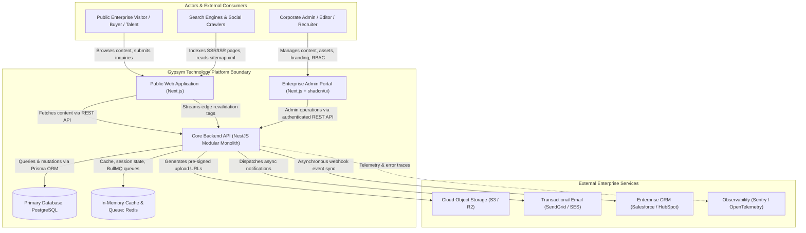

---

## 2. Architecture Principles

The architecture adheres to core software engineering principles designed to maintain velocity, modularity, and maintainability:

1. **Modular Monolith First:** The system is engineered as a single, modular backend codebase with strictly isolated domain boundaries. Individual domains (e.g., Media Transcoding, Candidate Processing) can be sliced into standalone microservices in the future with zero database redesign.
2. **Four-Layer Clean Architecture:**
   * **Presentation Layer:** Controllers (NestJS), Route Handlers, and Next.js UI Components.
   * **Application Layer:** Use cases, workflow orchestrators, DTOs, and event publishers.
   * **Domain Layer:** Pure business entities, state machines, validation rules, and repository interfaces.
   * **Infrastructure Layer:** Prisma ORM repositories, Redis cache clients, S3 storage adapters, and external mailers.
3. **Single Source of Truth (SSOT):** PostgreSQL serves as the persistent SSOT. Cached data in Redis and edge-cached HTML in Next.js are disposable and strictly invalidated upon state mutations.
4. **Decoupled Deployment Surfaces:** The Public Web and Admin Portal are isolated Next.js applications deployed independently to avoid blast-radius coupling during marketing content spikes or administrative releases.
5. **Zero-Downtime Dynamic Revalidation:** Public pages use Next.js Incremental Static Regeneration (ISR) with on-demand Tag-Based Invalidation (`revalidateTag()`), guaranteeing instant global updates without static rebuilds.
6. **Defense-in-Depth Security:** Multi-layer protection spanning Edge WAF, HTTP security headers, parameterized ORM queries, sanitization pipes, JWT authentication, and fine-grained RBAC guards.

---

## 3. Monorepo Architecture

The repository is structured as a **Turborepo** workspace, enabling shared code, unified type safety, deterministic dependency trees, and parallelized build/test pipelines.

### 3.1 Repository Layout

```
gypsym-advance-site/
├── apps/
│   ├── web/                     # Public Corporate Web Experience (Next.js App Router)
│   ├── admin/                   # Enterprise Admin CMS Portal (Next.js + shadcn/ui)
│   └── api/                     # Core Backend REST API (NestJS Modular Monolith)
├── packages/
│   ├── database/                # Prisma Schema, Migrations, Client wrapper, Seeds
│   ├── shared-types/            # Shared DTOs, Enums, API request/response contracts
│   ├── ui/                      # Shared design tokens, shared Radix/Tailwind components
│   ├── eslint-config/           # Shared enterprise lint rules (strict TypeScript)
│   └── tsconfig/                # Base TypeScript compiler options
├── turbo.json                   # Pipeline execution graph & remote cache rules
├── package.json                 # Monorepo root scripts
└── docker-compose.yml           # Local dev orchestration (PostgreSQL, Redis, MinIO)
```

---

## 4. Application Architecture

### 4.1 C4 Level 2: Container Diagram

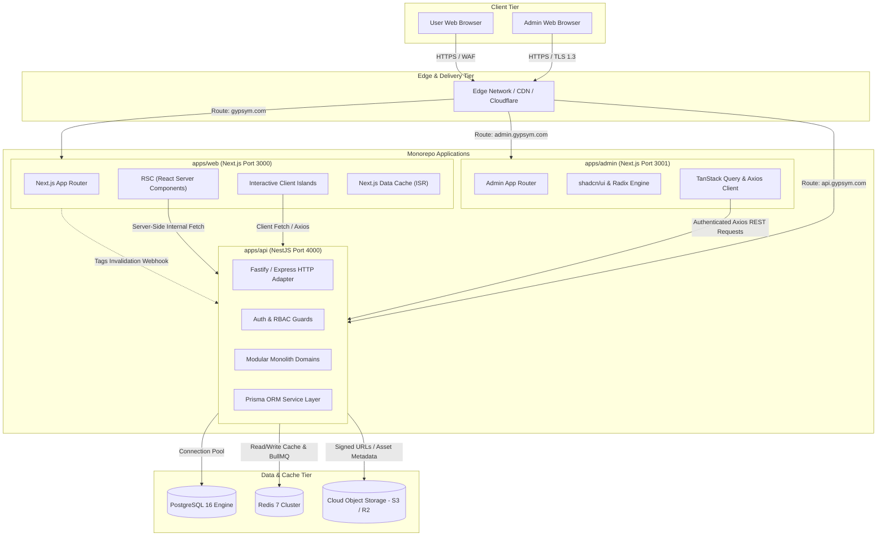

---

## 5. Frontend Architecture (Public Web: `apps/web`)

### 5.1 Presentation Pattern: React Server Components (RSC) + Selective Hydration
* **Server-First Execution:** Over 85% of public components are pure React Server Components (RSC), delivering zero client-side JavaScript for marketing copy, hero sections, and structural layouts.
* **Client Islands:** Interactive features (Search palette, mobile navigation drawer, dark mode switcher, dynamic inquiry form wizard) are encapsulated as isolated `'use client'` islands.
* **Axios API Client:** Encapsulated within a custom HTTP abstraction with unified error boundary interception, retry logic, and request tracing headers (`x-correlation-id`).

### 5.2 Frontend Component & Layout Architecture

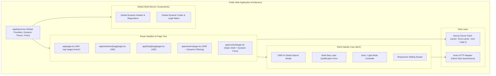

---

## 6. Backend Architecture (Core API: `apps/api`)

The NestJS backend implements a **Modular Monolith** organized into cohesive domain modules adhering to the Four-Layer Clean Architecture.

### 6.1 Clean Architecture Layering

```
┌────────────────────────────────────────────────────────┐
│                   PRESENTATION LAYER                   │
│   Controllers, Interceptors, Filters, Pipes, Guards    │
└───────────────────────────┬────────────────────────────┘
                            │ Calls Use Cases / Commands
                            ▼
┌────────────────────────────────────────────────────────┐
│                   APPLICATION LAYER                    │
│   Use Cases, Application Services, Command Handlers,   │
│   DTOs, AutoMappers, Domain Event Publishers           │
└───────────────────────────┬────────────────────────────┘
                            │ Enforces Domain Logic
                            ▼
┌────────────────────────────────────────────────────────┐
│                      DOMAIN LAYER                      │
│   Entities, Value Objects, Domain Exceptions,          │
│   State Machines, Repository Interfaces                │
└───────────────────────────▲────────────────────────────┘
                            │ Implements Interfaces
┌───────────────────────────┴────────────────────────────┐
│                  INFRASTRUCTURE LAYER                  │
│   Prisma Repositories, Database Context, Redis Cache,  │
│   S3 Storage Client, BullMQ Producers, External Mailers│
└────────────────────────────────────────────────────────┘
```

### 6.2 Backend Domain Module Map

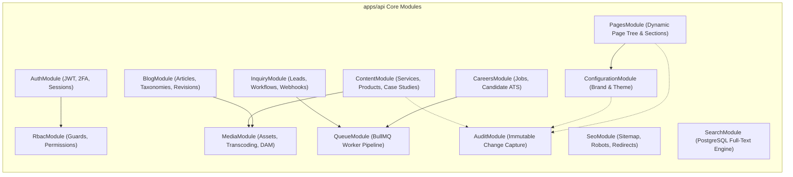

---

## 7. Admin Architecture (`apps/admin`)

The Admin Portal is a specialized, responsive, desktop-optimized single-page application built with Next.js (App Router), styled with Tailwind CSS and shadcn/ui.

### 7.1 Admin Layout & State Management
* **State Management Strategy:**
  * **Server State:** Managed via `@tanstack/react-query` for automatic cache invalidation, polling, and background re-fetching.
  * **Client UI State:** Managed via `zustand` for lightweight transient state (sidebar collapse, command palette open/close, active theme mode).
  * **Form Management:** `react-hook-form` paired with `zod` for compile-time and runtime validation.
* **Component Framework:** Powered by `shadcn/ui` (accessible Radix UI primitives with custom corporate styling).

### 7.2 Admin Architecture Flow

```mermaid
flowchart TD
    subgraph AdminAppTree ["Admin Application Workflow"]
        AdminAuthCheck["Auth Guard (Check Token & Refresh Session)"]
        
        subgraph ShellLayout ["Admin Shell (Responsive Sidebar & Navbar)"]
            CommandPalette["CMD+K Global Quick-Switcher"]
            StatusWidget["Live Health & Invalidation Status"]
            NavigationTree["Role-Filtered Sidebar Menu"]
        end

        subgraph AdminViews ["Workspace Views"]
            VisualBuilder["Dynamic Page & Section Builder"]
            ContentRegistry["Entity Workspaces (Services, Blogs, Case Studies)"]
            ThemeStudio["Brand & Dynamic Design Token Studio"]
            DAMExplorer["Digital Asset Manager (DAM) & File Explorer"]
            LeadsWorkbench["Inquiry Inbox & CRM Qualification Desk"]
            AuditExplorer["Security Audit Log Inspector"]
        end

        subgraph ClientInfra ["Client Infrastructure"]
            TanStackQuery["TanStack Query (Server State & Mutations)"]
            AxiosInterceptor["Axios Interceptor (Bearer Token & Auto-Refresh)"]
        end
    end

    AdminAuthCheck --> ShellLayout
    ShellLayout --> AdminViews
    AdminViews --> TanStackQuery
    TanStackQuery --> AxiosInterceptor
```

---

## 8. Database Architecture

### 8.1 Database Engine & Scaling Configuration
* **Engine:** PostgreSQL 16.
* **ORM:** Prisma ORM with strict type generation and migration workflows (`prisma migrate deploy`).
* **Connection Pooling:** PgBouncer connection pooling to handle high-concurrency public queries while maintaining persistent sessions for backend workers.
* **Indexing Strategy:**
  * B-tree indexes on all foreign keys and status/date filtering columns.
  * GIN indexes for PostgreSQL Full-Text Search (`tsvector`) and metadata JSONB fields.
  * Unique compound indexes on `(slug, deleted_at)` to support soft deletes while maintaining natural key uniqueness.

### 8.2 Entity-Relationship Diagram (ERD) Overview

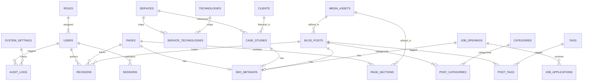

---

## 9. API Architecture

### 9.1 RESTful Resource Conventions
* **URI Versioning:** All endpoints are strictly versioned under `/api/v1/...`.
* **Standard Response Envelope:**
```typescript
interface ApiResponse<T> {
  success: boolean;
  data: T;
  meta?: {
    page?: number;
    limit?: number;
    totalCount?: number;
    totalPages?: number;
  };
  error?: {
    code: string;
    message: string;
    details?: unknown;
  };
  timestamp: string;
  correlationId: string;
}
```
* **HTTP Verbs:** Strict adherence to idempotency:
  * `GET`: Safe, cacheable.
  * `POST`: Unsafe, non-idempotent creation.
  * `PUT`: Unsafe, idempotent complete replacement.
  * `PATCH`: Unsafe, partial update.
  * `DELETE`: Idempotent soft deletion.

---

## 10. Authentication Architecture

### 10.1 Dual-Token Rotating Session Strategy
Authentication relies on short-lived Access Tokens paired with rotating Refresh Tokens.

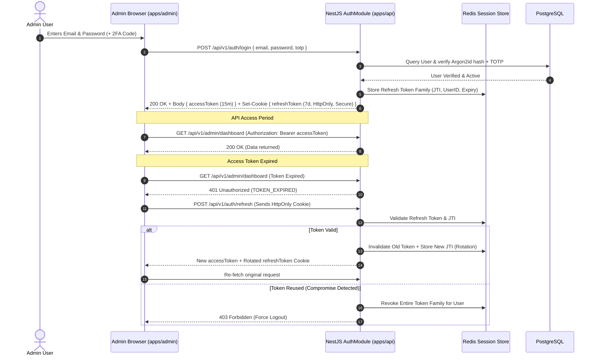

---

## 11. Authorization Architecture (RBAC)

### 11.1 Permission Evaluation Pipeline
The platform implements a declarative, attribute-aware RBAC mechanism.

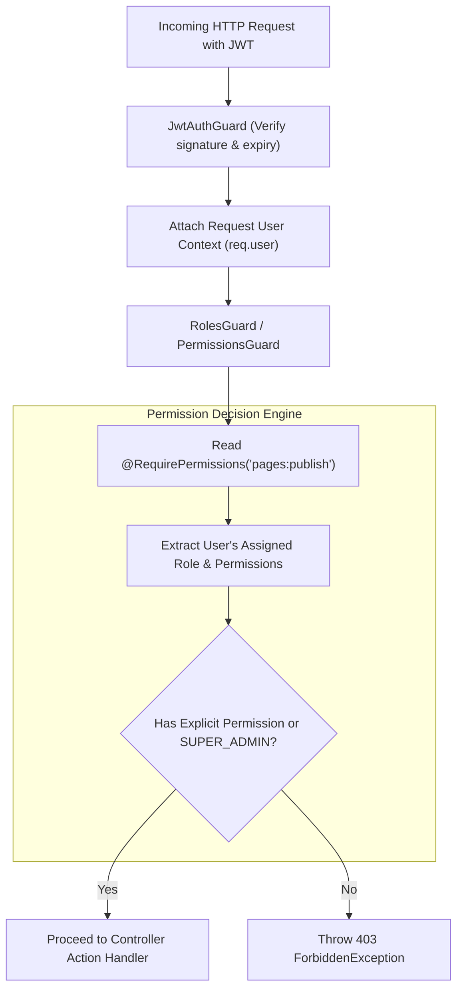

---

## 12. CMS Architecture & Lifecycle Engine

### 12.1 Publishing & Invalidation State Flow

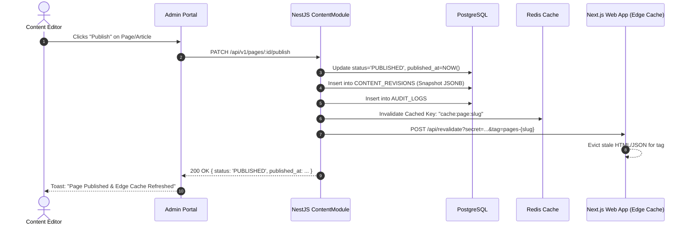

---

## 13. Digital Asset & Media Management (DAM) Architecture

### 13.1 Pre-Signed Upload & Asynchronous Optimization Pipeline

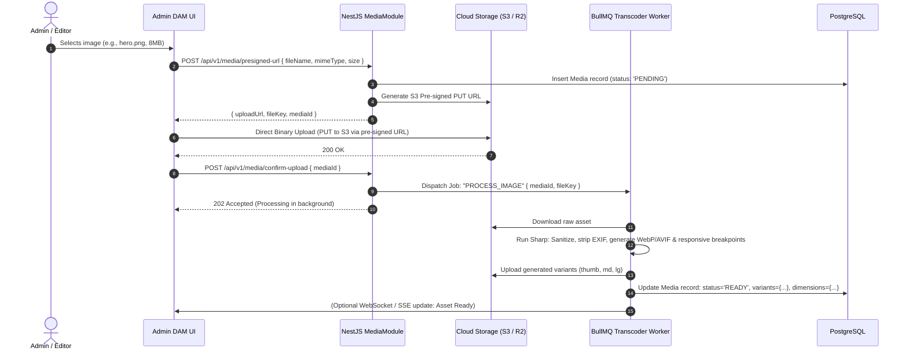

---

## 14. SEO Architecture & Edge Delivery

### 14.1 Dynamic Sitemap, Robots & On-Demand Revalidation
* **Dynamic Sitemap (`/sitemap.xml`):**
  * Handled via Next.js Route Handler querying `/api/v1/seo/sitemap-index`.
  * Grouped into sub-sitemaps if total URLs exceed 10,000 (`/sitemap-pages.xml`, `/sitemap-services.xml`, `/sitemap-blog.xml`).
  * Cached with TTL (1 hour) and invalidated whenever an entity enters the `PUBLISHED` or `ARCHIVED` state.
* **Dynamic Robots (`/robots.txt`):**
  * Generated from `system_settings` SEO configuration table.
  * Disallows `/admin`, `/api`, and private paths.
* **Redirect Engine:**
  * Integrated directly into Next.js middleware.
  * Reads cached redirect dictionary from Redis to achieve `< 5ms` execution for 301/302 redirects without querying the database.

---

## 15. Search Architecture

### 15.1 PostgreSQL Full-Text & Trigram Pipeline
Phase 1 utilizes PostgreSQL native full-text search with trigram indexing:

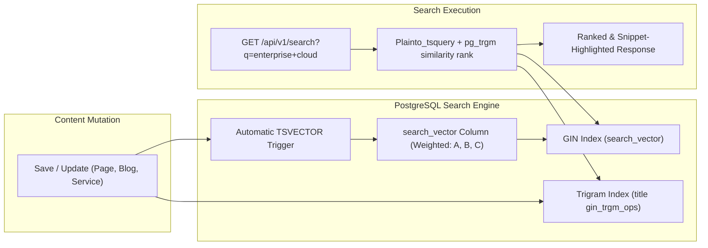

---

## 16. Caching Strategy

The caching strategy implements a multi-tier invalidation hierarchy:

```
[ Tier 1: Cloudflare Edge Cache ]
  └── Static Assets, Images, Cached HTML (TTL: 1 Year / Stale-While-Revalidate)
        │ (Cache Miss)
        ▼
[ Tier 2: Next.js Data Cache (ISR) ]
  └── Rendered RSC Payloads & HTML tagged with entity keys (e.g., 'page-home')
        │ (Cache Miss / Stale Tag)
        ▼
[ Tier 3: Application Cache (Redis) ]
  └── Serialized JSON API responses, Global Settings, Redirect Tables
        │ (Cache Miss)
        ▼
[ Tier 4: Database Storage (PostgreSQL 16) ]
  └── Primary Source of Truth with PgBouncer Connection Pool
```

* **On-Demand Tag Invalidation:**
  Whenever an admin updates an entity in the CMS, the backend calls Next.js edge revalidation endpoint:
  ```typescript
  // Triggered from NestJS ContentService
  await axios.post(`${WEB_APP_URL}/api/revalidate`, {
    tag: `content-${entityType}-${entitySlug}`,
    secret: process.env.REVALIDATION_TOKEN,
  });
  ```

---

## 17. Logging Strategy

* **Structured JSON Logging:** All log output is formatted in structured JSON using `Pino` (in NestJS) and transmitted to standard output (`stdout`).
* **Correlation ID Propagation:** Every request receives a unique `x-correlation-id` (UUIDv7) at the edge, passed downstream across Next.js and NestJS services.
* **Log Levels:**
  * `FATAL`: System-halting errors (Database connection drop, Redis cluster failure).
  * `ERROR`: Unhandled runtime exceptions, failed third-party integrations.
  * `WARN`: Deprecated endpoint usage, rate limit saturation, failed login attempts.
  * `INFO`: Successful state mutations, cron job runs, user logins.
  * `DEBUG`: Detailed query timings, HTTP request payloads (development/staging only).

---

## 18. Monitoring & Observability Strategy

1. **APM & Distributed Tracing:** Integrated via OpenTelemetry SDK exporting traces and metrics to Prometheus / Grafana or Datadog.
2. **Error Tracking:** Sentry SDK integrated into `apps/web`, `apps/admin`, and `apps/api` with source-map resolution and release tracking.
3. **Synthetic Health Probes:**
   * Liveness Probe: `GET /api/v1/health/liveness` (Returns HTTP 200 if process is alive).
   * Readiness Probe: `GET /api/v1/health/readiness` (Validates database connection and Redis ping before receiving ingress traffic).

---

## 19. Centralized Error Handling

### 19.1 Exception Filter Architecture
The NestJS API enforces a global exception filter catching all `HttpException` and unhandled standard errors:

```typescript
@Catch()
export class GlobalExceptionFilter implements ExceptionFilter {
  catch(exception: unknown, host: ArgumentsHost) {
    const ctx = host.switchToHttp();
    const response = ctx.getResponse<FastifyReply | Response>();
    const request = ctx.getRequest<FastifyRequest | Request>();

    const status = exception instanceof HttpException 
      ? exception.getStatus() 
      : HttpStatus.INTERNAL_SERVER_ERROR;

    const errorPayload = {
      success: false,
      error: {
        code: this.resolveErrorCode(exception),
        message: this.resolveErrorMessage(exception),
        details: this.resolveErrorDetails(exception),
      },
      timestamp: new Date().toISOString(),
      path: request.url,
      correlationId: request.headers['x-correlation-id'] || 'N/A',
    };

    response.status(status).json(errorPayload);
  }
}
```

---

## 20. Security Architecture

### 20.1 Defense Matrix

| Security Layer | Implementation Mechanism | Threat Mitigated |
| :--- | :--- | :--- |
| **Edge WAF** | Cloudflare Enterprise WAF / Rulesets | DDoS, volumetric bot attacks, Layer 7 flood |
| **Transport** | Enforced TLS 1.3, Strict-Transport-Security (HSTS) | Man-in-the-Middle (MitM) attacks |
| **Network & Application** | Helmet.js, Content Security Policy (CSP), CORS white-listing | Cross-Site Scripting (XSS), Clickjacking |
| **Authentication** | Argon2id password hashing, TOTP 2FA, JWT with JTI rotation | Credential stuffing, token replay |
| **Input Validation** | NestJS `ValidationPipe` with `class-validator`, DOMPurify on rich text | SQL Injection, Remote Code Execution, Stored XSS |
| **Rate Limiting** | Redis-backed `@nestjs/throttler` (tiered thresholds) | Brute-force logins, API abuse, lead spam |
| **Storage Security** | S3 Private Buckets + Pre-signed URLs + SVG sanitization | Malicious executable upload, XXE injection |

---

## 21. Performance Architecture

### 21.1 Edge Optimization & Asset Delivery
* **Static Assets:** Hosted on S3/R2 and cached on Cloudflare Edge nodes with immutable cache headers.
* **Modern Media:** All uploaded images automatically transcoded to AVIF and WebP with fallback PNG/JPEG.
* **Font Delivery:** Variable fonts loaded locally using `next/font` to eliminate Google Fonts render-blocking network hops.
* **Database Connection Pooling:** Managed via PgBouncer with keep-alive timeouts and max connection thresholds tuned to available PostgreSQL RAM.

---

## 22. Scalability Architecture

### 22.1 Horizontal Scaling Pathway

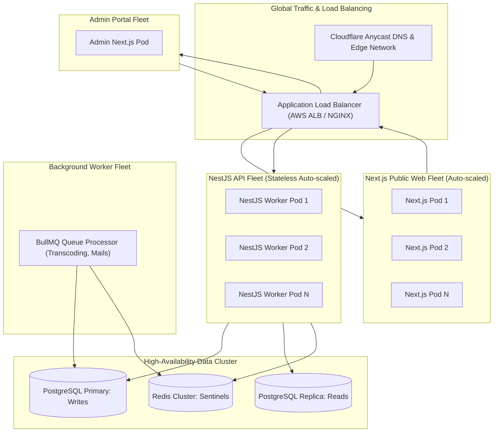

---

## 23. Deployment Architecture

### 23.1 Containerized Kubernetes / Container App Blueprint

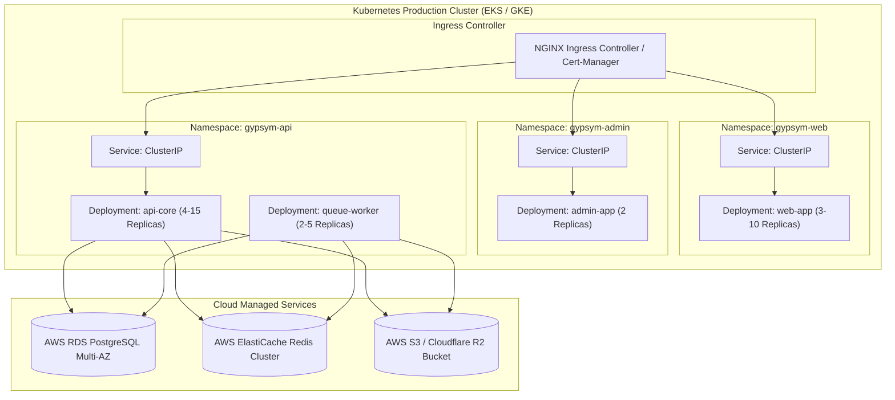

---

## 24. CI/CD Pipeline Architecture

### 24.1 Automated Delivery Lifecycle (GitHub Actions)

```mermaid
flowchart LR
    Developer["Git Push / PR"] --> LintTest["Turborepo CI: Lint, Typecheck, Test"]
    LintTest --> SecurityScan["SonarQube & Snyk Vulnerability Scan"]
    SecurityScan --> BuildDocker["Build Multi-Stage Docker Containers"]
    BuildDocker --> PushRegistry["Push to Amazon ECR / GitHub Packages"]
    PushRegistry --> DeployStaging["Deploy to Staging (Helm / ArgoCD)"]
    DeployStaging --> E2ETests["Playwright Integration & Smoke Tests"]
    E2ETests --> Approval["Manual Promotion Gate"]
    Approval --> DeployProd["Rolling Zero-Downtime Deploy to Prod"]
```

---

## 25. Backup and Disaster Recovery (DR)

* **Recovery Objectives:**
  * **Recovery Point Objective (RPO):** `<= 5 minutes` (continuous WAL archiving).
  * **Recovery Time Objective (RTO):** `<= 30 minutes` (automated infrastructure recovery).
* **Database Backups:**
  * Automated daily full snapshots retained for 30 days.
  * Continuous Write-Ahead Log (WAL) archiving to off-site cloud storage.
* **Media Asset Durability:**
  * Multi-region cross-bucket replication enabled for Cloud Storage.
* **Disaster Recovery Testing:**
  * Bi-annual automated restore drill to an isolated staging environment.

---

## 26. Environment Management

| Environment | Purpose | Ingress URL | Database | Cache |
| :--- | :--- | :--- | :--- | :--- |
| **Local Development** | Engineering feature development | `localhost:3000`, `3001`, `4000` | Local Docker PostgreSQL 16 | Local Docker Redis 7 |
| **CI / Automated Test** | PR validation, unit & integration tests | Ephemeral | In-memory / Testcontainers | In-memory Redis mock |
| **Staging / UAT** | Pre-production validation, client QA | `staging.gypsym.com`, `admin.staging...` | Managed RDS (Staging instance) | Managed ElastiCache (Shared) |
| **Production** | Live commercial operations | `gypsym.com`, `admin.gypsym.com` | Multi-AZ RDS PostgreSQL with Read Replicas | Multi-Node Redis Cluster |

---

## 27. Configuration Management

* **Zero Hardcoded Configuration:** All application configuration is injected via environment variables validated at process startup using `zod` schemas.
* **Secrets Management:** Sensitive keys (database credentials, JWT signing keys, storage secrets) stored in AWS Secrets Manager or HashiCorp Vault.
* **Dynamic Business Settings:** Managed in real time within the `system_settings` table in PostgreSQL, cached in Redis, and refreshed via pub/sub notifications.

---

## 28. Third-Party Integration Strategy

### 28.1 Asynchronous Outbox & Webhook Router
To maintain resilience and prevent external vendor outages from affecting public user experiences, all third-party integrations follow an **Asynchronous Outbox & Queue Pattern**:

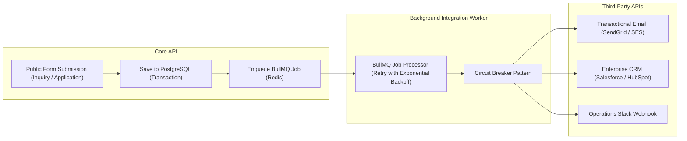

---

## 29. Key Architecture Diagrams: Deep-Dive Workflows

### 29.1 Data Flow: End-to-End Dynamic Page Request

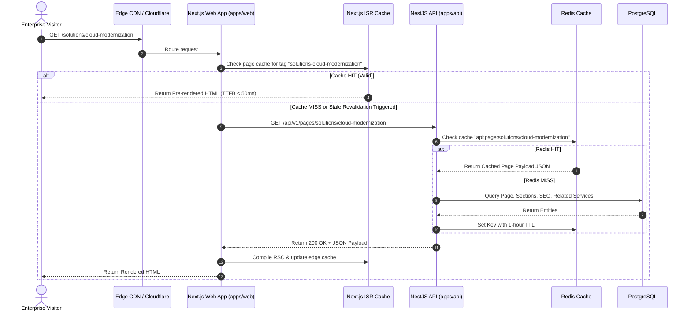

### 29.2 Contact & Lead Qualification Flow

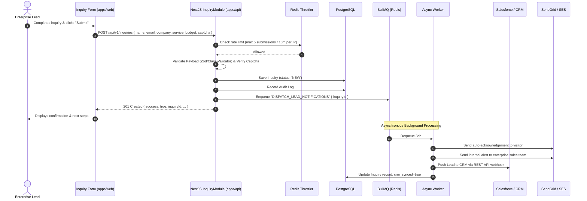

### 29.3 Blog Publishing & Editorial Workflow

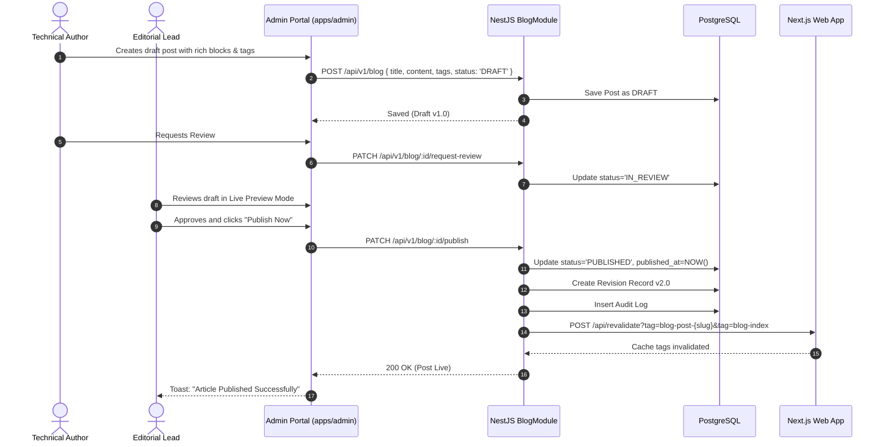

---

## 30. Conclusion & HLD Sign-Off Matrix

This High-Level Design directly implements all 25 operational requirements and dynamic governance models specified in the [PRD.md](file:///e:/dev/gypsym-advance-site/PRD.md). By establishing a modular monolith with clean architectural boundaries, zero-downtime cache invalidation, and decoupled Next.js presentation tiers, the system guarantees world-class performance, institutional security, and effortless future scalability.

### Sign-Off Approvals

| Role | Name / Title | Signature | Date |
| :--- | :--- | :--- | :--- |
| **Principal Enterprise Software Architect** | Technical Strategy Lead | *Approved* | Sep 10, 2026 |
| **Lead Solution Architect** | Core Backend & Infrastructure | *Pending Review* | - |
| **Principal UX & Frontend Architect** | Client Platforms Lead | *Pending Review* | - |
| **Chief Technology Officer (CTO)** | Executive Sponsor | *Pending Review* | - |

---
*End of High-Level Design (HLD). This document serves as the architectural foundation for the Low-Level Design (LLD) specification.*
