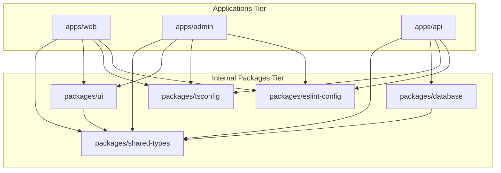
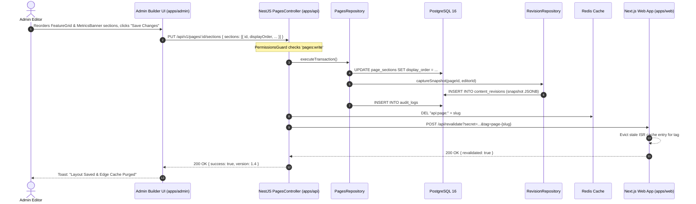
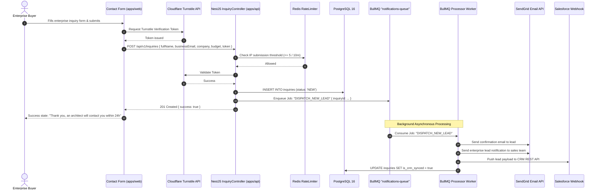

# Low-Level Design (LLD)
## Project: Gypsym Technology Digital Platform & Enterprise CMS

---

| Document Metadata | Value |
| :--- | :--- |
| **Document Version** | 1.0.0-LLD-SPEC |
| **Status** | Approved Engineering Blueprint |
| **Author** | Senior Staff Software Engineer & Low-Level Design Architect |
| **Baseline Architecture** | [PRD.md](file:///e:/dev/gypsym-advance-site/PRD.md) v1.0.0 & [HLD.md](file:///e:/dev/gypsym-advance-site/HLD.md) v1.0.0 |
| **Implementation Stack** | Next.js 14+ (App Router), NestJS 10+, TypeScript 5+, PostgreSQL 16, Prisma 5+, Tailwind CSS 3+, shadcn/ui, Axios |
| **Date** | September 2026 |

---

## 1. Monorepo Structure & Package Boundaries

The platform is organized as a Turborepo monorepo with strict unidirectional dependency rules.

### 1.1 Directory Tree

```
gypsym-advance-site/
├── apps/
│   ├── web/                           # Public Corporate Web Experience (Next.js)
│   │   ├── src/
│   │   │   ├── app/                   # App Router: Route groups, pages, layouts
│   │   │   ├── components/            # UI Components: Server & Client islands
│   │   │   ├── features/              # Domain-specific frontend modules
│   │   │   ├── hooks/                 # React hooks
│   │   │   ├── lib/                   # Utilities, Axios client, SEO helpers
│   │   │   └── types/                 # App-specific view models
│   │   ├── public/                    # Static public assets
│   │   ├── tailwind.config.ts         # Theme tokens consumed from @gypsym/ui
│   │   └── package.json
│   │
│   ├── admin/                         # Enterprise Admin Portal (Next.js SPA)
│   │   ├── src/
│   │   │   ├── app/                   # Admin App Router: (auth) & (dashboard)
│   │   │   ├── components/            # Admin layouts, tables, modals, forms
│   │   │   ├── features/              # Feature desks (CMS, DAM, IAM, Audit, Settings)
│   │   │   ├── hooks/                 # React hooks & TanStack Query hooks
│   │   │   ├── lib/                   # Axios interceptors, auth tokens, diff utils
│   │   │   └── stores/                # Zustand client UI state stores
│   │   ├── tailwind.config.ts
│   │   └── package.json
│   │
│   └── api/                           # Core Backend API (NestJS Modular Monolith)
│       ├── src/
│       │   ├── common/                # Shared filters, interceptors, guards, decorators
│       │   ├── config/                # Environment schemas & validation (Zod)
│       │   ├── database/              # PrismaService & transaction helpers
│       │   ├── modules/               # Domain-Driven NestJS Modules (see Section 3)
│       │   ├── app.module.ts          # Root module assembling domain modules
│       │   └── main.ts                # Bootstrap, Swagger, pipes, security middleware
│       ├── test/                      # E2E & integration test suites
│       └── package.json
│
├── packages/
│   ├── database/                      # Single Source of Truth for Data Layer
│   │   ├── prisma/
│   │   │   ├── schema.prisma          # Comprehensive relational database schema
│   │   │   ├── migrations/            # SQL migration history
│   │   │   └── seeds/                 # Deterministic seed scripts
│   │   ├── src/
│   │   │   ├── client.ts              # Exported PrismaClient singleton with extensions
│   │   │   └── index.ts
│   │   └── package.json
│   │
│   ├── shared-types/                  # Shared TypeScript Contracts & DTOs
│   │   ├── src/
│   │   │   ├── contracts/             # Request / Response payloads
│   │   │   ├── enums/                 # Roles, Statuses, Component Types
│   │   │   ├── models/                # Entity interfaces
│   │   │   └── validators/            # Shared Zod validation schemas
│   │   └── package.json
│   │
│   ├── ui/                            # Shared Design System Tokens & Radix Primitives
│   │   ├── src/
│   │   │   ├── components/            # Primitive UI: Button, Dialog, Dropdown, Table
│   │   │   ├── tokens/                # Color palettes, typography, spacing tokens
│   │   │   └── utils/                 # cn() class utility (clsx + tailwind-merge)
│   │   └── package.json
│   │
│   ├── eslint-config/                 # Enterprise ESLint configurations
│   └── tsconfig/                      # Shared tsconfig.base.json
│
├── turbo.json                         # Build caching graph & pipeline tasks
├── package.json                       # Monorepo root scripts
└── docker-compose.yml                 # Local PostgreSQL, Redis, MinIO services
```

### 1.2 Monorepo Dependency Rules



* **Rule 1:** `apps/web` and `apps/admin` MUST NEVER import `packages/database` or `apps/api` directly. All data access occurs over HTTP/REST contracts defined in `packages/shared-types`.
* **Rule 2:** `packages/shared-types` MUST NEVER import any external UI or database runtime dependencies (pure TypeScript interfaces and Zod schemas only).
* **Rule 3:** Cross-module dependencies inside `apps/api` must use NestJS Dependency Injection via exported Services or Event Emitters—direct table-level imports across modules are prohibited.

---

## 2. Shared Naming Conventions & Coding Standards

| Concept | Convention | Example |
| :--- | :--- | :--- |
| **Files & Folders** | `kebab-case` | `case-study.controller.ts`, `job-application-modal.tsx` |
| **TypeScript Classes & Interfaces** | `PascalCase` | `CreateBlogPostDto`, `AuthService`, `PageEntity` |
| **TypeScript Types & Enums** | `PascalCase` | `PublishStatus`, `UserRole`, `ApiEnvelope<T>` |
| **Methods & Functions** | `camelCase` | `findById()`, `handleContentPublish()`, `revalidateTag()` |
| **Constants & Environment Variables** | `UPPER_SNAKE_CASE` | `JWT_ACCESS_SECRET`, `DEFAULT_PAGE_SIZE` |
| **Database Tables & Columns** | `snake_case` (plural tables) | `blog_posts`, `client_id`, `published_at` |
| **REST Endpoints** | `kebab-case` plural nouns | `/api/v1/case-studies`, `/api/v1/job-openings` |
| **React Component Files** | `PascalCase` or `kebab-case` | `HeroSection.tsx`, `mega-menu.tsx` |

---

## 3. Backend Module Implementation Specifications (`apps/api`)

The backend is decomposed into 10 Domain Clusters housing the required 38 backend sub-modules. Each module adheres strictly to Clean Architecture layering:

```
[Controller] -> [Service] -> [Repository] -> [PrismaClient / Redis / S3]
     │              │              │
   (DTOs)     (Domain Models)   (Entities)
```

---

### Cluster 1: Identity & Access Management (IAM)
**Modules:** `auth`, `users`, `roles`, `permissions`, `admin`

#### 3.1 `AuthModule`
* **Purpose:** Handles administrator authentication, session rotation, TOTP 2FA, password recovery, and token refresh lifecycles.
* **Components:**
  * `AuthController`: Exposes login, refresh, logout, 2FA setup, 2FA verify.
  * `AuthService`: Validates credentials, executes Argon2id hashing, issues JWT pairs, verifies TOTP via `otplib`.
  * `SessionRepository`: Tracks active refresh token families in Redis (`session:{userId}:{jti}`).
* **DTOs & Validators:**
  * `LoginDto`: `{ email: string (z.string().email()), password: string (z.string().min(8)), totpCode?: string (z.string().length(6).optional()) }`
  * `RefreshTokenDto`: `{ refreshToken: string }`
  * `Enable2FaResponseDto`: `{ secret: string, qrCodeDataUrl: string, backupCodes: string[] }`
  * `AuthTokenResponseDto`: `{ accessToken: string, user: UserPublicProfileDto }`
* **Guards & Decorators:**
  * `JwtAuthGuard`: Validates Bearer access token signature, expiration, and payload (`userId`, `role`, `permissions`).
  * `Public()`: Metadata decorator bypassing authentication for open endpoints.
  * `CurrentUser()`: Parameter decorator extracting user payload from `req.user`.
* **API Endpoints:**
  * `POST /api/v1/auth/login` → `200 OK`
  * `POST /api/v1/auth/refresh` → `200 OK` (reads `HttpOnly` cookie)
  * `POST /api/v1/auth/logout` → `204 No Content`
  * `POST /api/v1/auth/2fa/setup` → `200 OK` (`@UseGuards(JwtAuthGuard)`)
  * `POST /api/v1/auth/2fa/verify` → `200 OK`
* **Error Classes:** `InvalidCredentialsException` (401), `TokenExpiredException` (401), `SessionRevokedException` (403), `TwoFactorRequiredException` (403).

#### 3.2 `UsersModule`, `RolesModule`, `PermissionsModule`, `AdminModule`
* **Purpose:** User lifecycle administration, role-permission assignment matrix, and platform admin health telemetry.
* **Entities:**
  * `User`: `id` (UUID), `email`, `password_hash`, `first_name`, `last_name`, `role_id`, `is_active`, `is_2fa_enabled`, `two_factor_secret`, `last_login_at`, `created_at`, `updated_at`.
  * `Role`: `id`, `key` (SUPER_ADMIN, SYSTEM_ADMIN, CONTENT_EDITOR, RECRUITER, AUDITOR), `name`, `description`.
  * `Permission`: `id`, `key` (e.g., `pages:write`, `careers:publish`), `module`, `description`.
* **Guards & Policies:**
  * `PermissionsGuard`: Compares required permissions declared via `@RequirePermissions('users:manage')` against `req.user.permissions`.
* **Events Emitted:** `UserCreatedEvent`, `UserDeactivatedEvent`, `RolePermissionsUpdatedEvent`.

---

### Cluster 2: Platform Governance & Dynamic Branding
**Modules:** `settings`, `branding`, `navigation`

#### 3.3 `SettingsModule` & `BrandingModule`
* **Purpose:** Code-free administrative control over brand tokens, dynamic typography, color palettes, logos, and global corporate parameters.
* **Entities:**
  * `SystemSetting`: `id`, `category` (BRANDING, GENERAL, CONTACT, LEGAL, SOCIAL), `key` (unique), `value` (`JSONB`), `is_public` (boolean), `updated_by`, `updated_at`.
* **Controller Endpoints:**
  * `GET /api/v1/settings/public` → `200 OK` (Public, cached with Redis TTL 1h; returns public brand tokens, logos, contact info).
  * `GET /api/v1/admin/settings` → `200 OK` (Admin; requires `settings:read`).
  * `PUT /api/v1/admin/settings/:key` → `200 OK` (Admin; requires `settings:write`).
* **Branding Payload Schema (JSONB):**
```typescript
interface BrandingConfig {
  companyName: string;
  legalEntityName: string;
  logos: {
    primaryLightUrl: string;
    primaryDarkUrl: string;
    monogramUrl: string;
    faviconUrl: string;
  };
  colors: {
    brandPrimary: string;        // HSL or Hex
    brandSecondary: string;
    brandAccent: string;
    surfaceElevatedLight: string;
    surfaceElevatedDark: string;
  };
  typography: {
    fontFamilySans: string;      // Inter, Outfit, Roboto
    fontFamilyMono: string;
    baseScaleRatio: number;
  };
}
```
* **Database & Cache Interaction:** On `PUT /settings/:key`, write to PostgreSQL, evict `cache:settings:public` from Redis, and dispatch an edge revalidation event for tag `brand-tokens`.

#### 3.4 `NavigationModule`
* **Purpose:** Hierarchical mega-menu and footer link management.
* **Entities:**
  * `NavigationMenu`: `id`, `location` (HEADER, FOOTER_COL_1, FOOTER_COL_2, FOOTER_COL_3, FOOTER_LEGAL), `title`, `is_active`.
  * `NavigationItem`: `id`, `menu_id`, `parent_id` (nullable for nesting), `label`, `path`, `icon_name`, `badge_text`, `is_external`, `display_order`, `metadata` (`JSONB`).
* **Endpoints:**
  * `GET /api/v1/navigation/header` → `200 OK` (returns nested tree)
  * `GET /api/v1/navigation/footer` → `200 OK`
  * `PUT /api/v1/admin/navigation/:location` → `200 OK` (bulk reorder/save tree)

---

### Cluster 3: Dynamic Page & Section Layouts
**Modules:** `pages`, `page-sections`

#### 3.5 `PagesModule` & `PageSectionsModule`
* **Purpose:** Orchestrates dynamic URL route resolution and section component trees.
* **Entities:**
  * `Page`: `id`, `slug` (unique indexed), `title`, `description`, `layout_type` (DEFAULT, FULL_WIDTH, MINIMAL), `status` (DRAFT, SCHEDULED, PUBLISHED, ARCHIVED), `published_at`, `created_at`, `updated_at`, `deleted_at`.
  * `PageSection`: `id`, `page_id`, `section_identifier`, `display_order` (int), `component_type` (HERO, FEATURE_GRID, METRICS_BANNER, CTA_STRIP, LOGO_CLOUD, TESTIMONIAL_SLIDER, ACCORDION_FAQ, CUSTOM_HTML), `content_payload` (`JSONB`), `styles_override` (`JSONB`), `is_active` (boolean).
* **DTOs:**
  * `CreatePageDto`: `{ slug: string, title: string, layoutType?: PageLayoutType }`
  * `UpdatePageSectionDto`: `{ sectionIdentifier: string, componentType: string, contentPayload: Record<string, any>, displayOrder: number, isActive: boolean }`
* **Lifecycle & Revision Management:**
  * Mutations trigger insertion into `ContentRevision` (`entity_type: 'PAGE'`).
  * Publishing triggers `RevalidateService.revalidateTag('page-' + slug)`.

---

### Cluster 4: Digital Asset Management (DAM)
**Modules:** `media`, `assets`

#### 3.6 `MediaModule`
* **Purpose:** Object storage orchestration, pre-signed upload URL issuance, asset metadata extraction, and asynchronous variant generation.
* **Entities:**
  * `MediaAsset`: `id`, `original_filename`, `storage_key`, `mime_type`, `file_size_bytes`, `width`, `height`, `aspect_ratio`, `alt_text`, `caption`, `folder_path`, `variants` (`JSONB`), `status` (PENDING, PROCESSING, READY, FAILED), `created_at`.
* **Repository:** `MediaRepository` executes raw database queries and handles S3 SDK adapter interactions (`GetObjectCommand`, `PutObjectCommand`).
* **Endpoints:**
  * `POST /api/v1/media/presign-upload` → `201 Created`
    * Request: `{ fileName: string, mimeType: string, fileSize: number, folderPath?: string }`
    * Response: `{ mediaId: string, uploadUrl: string, storageKey: string, headers: Record<string, string> }`
  * `POST /api/v1/media/confirm-upload` → `200 OK` (enqueues BullMQ image optimization job)
  * `GET /api/v1/media` → `200 OK` (query filters: `folderPath`, `mimeType`, `search`, pagination)
  * `PATCH /api/v1/media/:id` → `200 OK` (update `alt_text`, `caption`)
  * `DELETE /api/v1/media/:id` → `204 No Content` (soft delete or purge from S3)

---

### Cluster 5: Solutions & Commercial Portfolio
**Modules:** `services`, `solutions`, `industries`, `technologies`, `case-studies`, `projects`, `clients`, `testimonials`

#### 3.7 `ServicesModule` & `SolutionsModule`
* **Purpose:** Hierarchical technology offerings, capability trees, and industry solutions.
* **Entities:**
  * `Service`: `id`, `slug`, `title`, `tagline`, `short_description`, `detailed_content` (`JSONB`), `icon_url`, `featured_image_url`, `display_order`, `parent_service_id`, `status`.
  * `Industry`: `id`, `slug`, `name`, `description`, `icon_url`.
  * `Technology`: `id`, `slug`, `name`, `category` (CLOUD, DATA, AI, FRONTEND, SECURITY), `icon_url`.
* **Relationships:** Many-to-many between `Service` and `Technology`, `Service` and `Industry`.

#### 3.8 `CaseStudiesModule`, `ClientsModule`, `TestimonialsModule`, `ProjectsModule`
* **Entities:**
  * `Client`: `id`, `slug`, `name`, `logo_light_url`, `logo_dark_url`, `website_url`, `tier` (STRATEGIC, ENTERPRISE, SHOWCASE), `display_order`.
  * `CaseStudy`: `id`, `slug`, `title`, `client_id`, `summary`, `challenge_statement`, `solution_statement`, `impact_metrics` (`JSONB`), `cover_image_url`, `status`, `published_at`.
  * `Testimonial`: `id`, `quote`, `author_name`, `author_title`, `author_company`, `avatar_url`, `client_id`, `rating`, `is_featured`.

---

### Cluster 6: Corporate Leadership & Trust
**Modules:** `team`, `certifications`, `awards`, `partners`, `faqs`

#### 3.9 Implementation Details
* **Entities:**
  * `TeamMember`: `id`, `slug`, `full_name`, `role_title`, `department`, `bio`, `avatar_url`, `linkedin_url`, `display_order`, `is_leadership`.
  * `Certification`: `id`, `title`, `issuing_body`, `valid_from`, `valid_until`, `badge_icon_url`, `compliance_scope`.
  * `Award`: `id`, `title`, `issuing_organization`, `year`, `badge_image_url`, `verification_link`.
  * `Partner`: `id`, `name`, `partner_tier` (GLOBAL_ALLIANCE, PLATINUM, PREMIER), `logo_url`, `partnership_details`.
  * `Faq`: `id`, `category` (SERVICES, SECURITY, GENERAL, BILLING), `question`, `answer_content`, `display_order`.

---

### Cluster 7: Talent & Recruitment
**Modules:** `careers`, `jobs`

#### 3.10 `CareersModule` & `JobsModule`
* **Entities:**
  * `JobOpening`: `id`, `slug`, `requisition_code`, `title`, `department`, `location_type` (REMOTE, HYBRID, ONSITE), `location_name`, `employment_type`, `experience_level`, `salary_range_display`, `overview`, `responsibilities` (`JSONB`), `qualifications` (`JSONB`), `status`, `expires_at`.
  * `JobApplication`: `id`, `job_opening_id`, `first_name`, `last_name`, `email`, `phone`, `linkedin_url`, `portfolio_url`, `resume_file_key`, `cover_letter`, `status` (NEW, SCREENING, INTERVIEWING, OFFER, REJECTED), `created_at`.
* **Security Note:** `resume_file_key` points to a private, non-public S3 bucket. Recruiters generate time-limited pre-signed GET URLs (`expiresIn: 300`) to inspect candidate resumes.

---

### Cluster 8: Editorial & Knowledge Hub
**Modules:** `blogs`, `blog-categories`, `blog-tags`

#### 3.11 `BlogModule`
* **Entities:**
  * `BlogPost`: `id`, `slug`, `title`, `excerpt`, `body_content` (`JSONB` structured blocks), `featured_image_url`, `author_id`, `primary_category_id`, `read_time_minutes`, `status`, `published_at`.
  * `BlogCategory`: `id`, `slug`, `name`, `description`.
  * `BlogTag`: `id`, `slug`, `name`.
* **Endpoints:**
  * Public: `GET /api/v1/blog` (supports filter by category slug, tag, search query, page/limit).
  * Public: `GET /api/v1/blog/:slug` (increments view metric asynchronously).
  * Admin: Full CRUD with state machine transitions (`DRAFT` → `SCHEDULED` → `PUBLISHED`).

---

### Cluster 9: Inbound Inquiries & Growth
**Modules:** `contact`, `enquiries`, `newsletter`

#### 3.12 `InquiryModule` & `NewsletterModule`
* **Entities:**
  * `Inquiry`: `id`, `full_name`, `business_email`, `phone`, `company_name`, `job_title`, `service_category_id`, `budget_range`, `timeline`, `project_description`, `status` (NEW, QUALIFIED, CONTACTED, DISQUALIFIED), `utm_source`, `utm_medium`, `utm_campaign`, `ip_address`, `created_at`.
  * `NewsletterSubscriber`: `id`, `email` (unique), `is_verified`, `verification_token`, `subscribed_at`, `unsubscribed_at`.
* **Spam & Anti-Abuse Defense:**
  * Integrated Cloudflare Turnstile token validation pipe (`TurnstileValidationPipe`).
  * Enforced rate limiting via Redis Throttler (`@Throttle({ default: { limit: 5, ttl: 600000 } })`).
  * Async BullMQ dispatch to notification emailers and external CRM webhooks.

---

### Cluster 10: Platform Operations & Cross-Cutting
**Modules:** `seo`, `analytics`, `audit-logs`, `notifications`

#### 3.13 Implementation Details
* **`SeoModule`:** Manages `SEOMetadata` (polymorphic 1:1 relation to Pages, Services, Blogs, Jobs), dynamic XML sitemaps, and robots.txt generation.
* **`AuditLogsModule`:** Append-only interceptor (`AuditLogInterceptor`) capturing mutations on sensitive entities into `audit_logs` (`id`, `actor_id`, `action`, `resource_type`, `resource_id`, `diff_payload`, `ip_address`, `created_at`).
* **`NotificationsModule`:** Redis BullMQ queue producer dispatching transactional emails (SendGrid / AWS SES) and operational Slack webhooks.

---

## 4. Public Frontend Implementation Specifications (`apps/web`)

### 4.1 Next.js App Router Structure & Route Groups

```
apps/web/src/app/
├── (marketing)/                       # Marketing route group (standard header/footer)
│   ├── layout.tsx                     # Global marketing layout (Dynamic Header, Footer)
│   ├── page.tsx                       # Homepage (ISR, revalidate: 3600)
│   ├── about/
│   │   └── page.tsx                   # Company Story, Leadership, Awards
│   ├── solutions/
│   │   ├── page.tsx                   # Solution matrix
│   │   └── [slug]/
│   │       └── page.tsx               # Solution detail (ISR)
│   ├── services/
│   │   ├── page.tsx                   # Service catalog
│   │   └── [slug]/
│   │       └── page.tsx               # Service detail (ISR)
│   ├── case-studies/
│   │   ├── page.tsx                   # Filterable case study catalog
│   │   └── [slug]/
│   │       └── page.tsx               # Case study deep dive
│   ├── technology/
│   │   └── page.tsx                   # Tech radar & enterprise capabilities
│   ├── contact/
│   │   └── page.tsx                   # Interactive lead inquiry wizard
│   └── careers/
│       ├── page.tsx                   # Culture, benefits & job search
│       └── [slug]/
│           └── page.tsx               # Job details & direct application
│
├── (insights)/                        # Knowledge Hub route group
│   ├── layout.tsx                     # Blog layout with category drawer
│   ├── blog/
│   │   ├── page.tsx                   # Article index with pagination
│   │   └── [slug]/
│   │       └── page.tsx               # Article reading view with TOC
│   └── faqs/
│       └── page.tsx                   # Faceted FAQ accordion view
│
├── (legal)/                           # Legal & Trust Center route group
│   ├── layout.tsx                     # Compact legal document shell
│   ├── privacy/
│   │   └── page.tsx
│   ├── terms/
│   │   └── page.tsx
│   └── security/
│       └── page.tsx
│
├── api/                               # Route Handlers
│   ├── revalidate/
│   │   └── route.ts                   # On-demand ISR tag revalidation webhook
│   ├── sitemap.xml/
│   │   └── route.ts                   # Dynamic XML sitemap generator
│   └── robots.txt/
│       └── route.ts                   # Dynamic robots.txt generator
│
├── layout.tsx                         # Root layout (Theme provider, Fonts, Analytics)
├── not-found.tsx                      # Branded 404 handler
├── error.tsx                          # Global error boundary island
└── global.css                         # Tailwind directives & CSS variables
```

### 4.2 Server vs. Client Component Boundaries

| Component | Execution Context | Rationale |
| :--- | :--- | :--- |
| `Header` / `Footer` | **Server Component** | Static markup generated on server; dynamic links injected via API. |
| `MegaMenuDropdown` | **Client Component** (`'use client'`) | Interactive hover state, keyboard navigation trap, animation triggers. |
| `HeroSection` | **Server Component** | Renders semantic H1 and critical media immediately for fast LCP. |
| `SearchModal` | **Client Component** (`'use client'`) | Listens for `CMD+K`, manages local search input state, debounced API calls. |
| `InquiryFormWizard` | **Client Component** (`'use client'`) | Multi-step form state, validation, Turnstile captcha execution. |
| `CaseStudyMetrics` | **Server Component** | Renders static stats blocks with zero client JS bundle overhead. |
| `ThemeToggle` | **Client Component** (`'use client'`) | Accesses browser `localStorage` and toggles `dark` class on root HTML. |

### 4.3 Axios API Client Configuration (`apps/web/src/lib/api-client.ts`)

```typescript
import axios, { AxiosInstance, AxiosError } from 'axios';

export const apiClient: AxiosInstance = axios.create({
  baseURL: process.env.NEXT_PUBLIC_API_URL || 'http://localhost:4000/api/v1',
  timeout: 10000,
  headers: {
    'Content-Type': 'application/json',
    'Accept': 'application/json',
  },
});

apiClient.interceptors.request.use((config) => {
  if (typeof window !== 'undefined') {
    // Generate trace correlation ID for browser requests
    config.headers['x-correlation-id'] = crypto.randomUUID();
  }
  return config;
});

apiClient.interceptors.response.use(
  (response) => response.data,
  (error: AxiosError) => {
    const formattedError = {
      message: error.response?.data?.error?.message || error.message || 'An unexpected error occurred',
      statusCode: error.response?.status || 500,
      code: error.response?.data?.error?.code || 'UNKNOWN_ERROR',
      details: error.response?.data?.error?.details,
    };
    return Promise.reject(formattedError);
  }
);
```

### 4.4 Data Fetching & On-Demand ISR Strategy
Next.js Server Components query the NestJS API using native `fetch` with configured cache tags:

```typescript
// Example: apps/web/src/app/(marketing)/solutions/[slug]/page.tsx
export async function generateMetadata({ params }: { params: { slug: string } }): Promise<Metadata> {
  const solution = await getSolutionBySlug(params.slug);
  return {
    title: solution.seoMeta?.title || `${solution.title} | Gypsym Technology`,
    description: solution.seoMeta?.description || solution.shortDescription,
    alternates: { canonical: solution.seoMeta?.canonicalUrl },
    openGraph: {
      images: [solution.seoMeta?.ogImageUrl || solution.featuredImageUrl],
    },
  };
}

async function getSolutionBySlug(slug: string) {
  const res = await fetch(`${process.env.INTERNAL_API_URL}/api/v1/solutions/${slug}`, {
    next: { tags: [`solution-${slug}`, 'solutions-all'] },
    headers: { 'x-internal-token': process.env.INTERNAL_SERVICE_SECRET! },
  });
  if (!res.ok) notFound();
  return (await res.json()).data;
}
```

---

## 5. Enterprise Admin Portal Implementation Specifications (`apps/admin`)

### 5.1 Admin App Router Structure

```
apps/admin/src/app/
├── (auth)/
│   ├── layout.tsx                     # Centered clean card layout
│   ├── login/
│   │   └── page.tsx                   # Email/password form + 2FA challenge modal
│   └── forgot-password/
│       └── page.tsx
│
├── (dashboard)/
│   ├── layout.tsx                     # Protected shell: Collapsible Sidebar, Header, Breadcrumbs
│   ├── page.tsx                       # Executive Telemetry & Operational Dashboard
│   ├── pages/                         # Dynamic Page Builder
│   │   ├── page.tsx                   # Page tree list view
│   │   ├── new/page.tsx               # Create page wizard
│   │   └── [id]/builder/page.tsx      # Section drag-and-drop live builder
│   ├── content/                       # Content Registries
│   │   ├── services/page.tsx
│   │   ├── case-studies/page.tsx
│   │   ├── clients/page.tsx
│   │   └── testimonials/page.tsx
│   ├── blog/                          # Editorial Hub
│   │   ├── page.tsx                   # Post list with status filters
│   │   ├── new/page.tsx               # Block-based article editor
│   │   └── [id]/edit/page.tsx
│   ├── media/                         # Digital Asset Manager (DAM)
│   │   └── page.tsx                   # Virtual folders, bulk uploader, asset editor
│   ├── careers/                       # Recruitment Desk
│   │   ├── jobs/page.tsx              # Job opening manager
│   │   └── candidates/page.tsx        # Applicant review & resume viewer
│   ├── inquiries/                     # Inbound Lead Inbox
│   │   └── page.tsx                   # CRM triage desk & CSV exporter
│   ├── settings/                      # Platform Governance
│   │   ├── branding/page.tsx          # Dynamic colors, fonts, logo studio
│   │   ├── navigation/page.tsx        # Mega-menu tree editor
│   │   └── seo/page.tsx               # Robots, sitemaps, redirect rules
│   ├── iam/                           # Access Control
│   │   ├── users/page.tsx
│   │   └── roles/page.tsx
│   └── audit/                         # Compliance & Audit Trail
│       └── page.tsx                   # Log explorer with JSON diff inspector
│
└── layout.tsx                         # Root admin layout (TanStack Query, Toast provider)
```

### 5.2 Dynamic Page Builder Implementation (`/pages/[id]/builder`)
* **State Management:** Local builder state managed via `zustand` (`usePageBuilderStore`) supporting undo/redo history stacks.
* **Component Registry:**
  * Maps `component_type` string (`HERO`, `METRICS_BANNER`, `FEATURE_GRID`) to specific React configuration forms and sandboxed preview renderers.
* **Drag-and-Drop:** Built using `@dnd-kit/core` and `@dnd-kit/sortable` for fluid section reordering.
* **Revision Snapshotting:** On Save, sends complete array of ordered sections to `PUT /api/v1/pages/:id/sections`, creating a new historical revision entry in PostgreSQL.

---

## 6. Comprehensive Database Schema (Prisma ORM)

Below is the complete, production-grade schema definition for `packages/database/prisma/schema.prisma`:

```prisma
datasource db {
  provider = "postgresql"
  url      = env("DATABASE_URL")
}

generator client {
  provider        = "prisma-client-js"
  previewFeatures = ["fullTextSearch", "postgresqlExtensions"]
}

// -------------------------------------------------------------
// ENUMS
// -------------------------------------------------------------

enum RoleType {
  SUPER_ADMIN
  SYSTEM_ADMIN
  CONTENT_EDITOR
  RECRUITMENT_OFFICER
  READ_ONLY_AUDITOR
}

enum ContentStatus {
  DRAFT
  SCHEDULED
  PUBLISHED
  ARCHIVED
  TRASHED
}

enum PageLayoutType {
  DEFAULT
  FULL_WIDTH
  LANDING
  MINIMAL
}

enum ComponentType {
  HERO
  FEATURE_GRID
  METRICS_BANNER
  CTA_STRIP
  LOGO_CLOUD
  TESTIMONIAL_SLIDER
  ACCORDION_FAQ
  TABBED_SOLUTIONS
  CUSTOM_HTML
}

enum MediaStatus {
  PENDING
  PROCESSING
  READY
  FAILED
}

enum InquiryStatus {
  NEW
  QUALIFIED
  CONTACTED
  OPPORTUNITY
  DISQUALIFIED
}

enum ApplicationStatus {
  NEW
  REVIEWING
  SCREENING
  INTERVIEWING
  OFFER
  REJECTED
  HIRED
}

enum WorkLocationType {
  REMOTE
  HYBRID
  ONSITE
}

enum EmploymentType {
  FULL_TIME
  PART_TIME
  CONTRACT
}

// -------------------------------------------------------------
// IDENTITY & ACCESS MANAGEMENT (IAM)
// -------------------------------------------------------------

model User {
  id                 String            @id @default(uuid()) @db.Uuid
  email              String            @unique
  passwordHash       String            @map("password_hash")
  firstName          String            @map("first_name")
  lastName           String            @map("last_name")
  isActive           Boolean           @default(true) @map("is_active")
  isTwoFactorEnabled Boolean           @default(false) @map("is_2fa_enabled")
  twoFactorSecret    String?           @map("two_factor_secret")
  roleId             String            @map("role_id") @db.Uuid
  role               Role              @relation(fields: [roleId], references: [id])
  lastLoginAt        DateTime?         @map("last_login_at")
  createdAt          DateTime          @default(now()) @map("created_at")
  updatedAt          DateTime          @updatedAt @map("updated_at")
  deletedAt          DateTime?         @map("deleted_at")

  authoredPosts      BlogPost[]
  revisions          ContentRevision[]
  auditLogs          AuditLog[]

  @@index([email])
  @@index([roleId])
  @@map("users")
}

model Role {
  id          String       @id @default(uuid()) @db.Uuid
  key         RoleType     @unique
  name        String
  description String?
  permissions Permission[] @relation("RolePermissions")
  users       User[]

  @@map("roles")
}

model Permission {
  id          String   @id @default(uuid()) @db.Uuid
  key         String   @unique
  module      String
  description String?
  roles       Role[]   @relation("RolePermissions")

  @@map("permissions")
}

// -------------------------------------------------------------
// DYNAMIC PAGES & SECTIONS
// -------------------------------------------------------------

model Page {
  id           String            @id @default(uuid()) @db.Uuid
  slug         String            @unique
  title        String
  description  String?
  layoutType   PageLayoutType    @default(DEFAULT) @map("layout_type")
  status       ContentStatus     @default(DRAFT)
  publishedAt  DateTime?         @map("published_at")
  createdAt    DateTime          @default(now()) @map("created_at")
  updatedAt    DateTime          @updatedAt @map("updated_at")
  deletedAt    DateTime?         @map("deleted_at")

  sections     PageSection[]
  seoMetadata  SeoMetadata?      @relation("PageSeo")
  revisions    ContentRevision[] @relation("PageRevisions")

  @@index([slug, deletedAt])
  @@index([status])
  @@map("pages")
}

model PageSection {
  id                String        @id @default(uuid()) @db.Uuid
  pageId            String        @map("page_id") @db.Uuid
  page              Page          @relation(fields: [pageId], references: [id], onDelete: Cascade)
  sectionIdentifier String        @map("section_identifier")
  displayOrder      Int           @map("display_order")
  componentType     ComponentType @map("component_type")
  contentPayload    Json          @map("content_payload")
  stylesOverride    Json?         @map("styles_override")
  isActive          Boolean       @default(true) @map("is_active")
  createdAt         DateTime      @default(now()) @map("created_at")
  updatedAt         DateTime      @updatedAt @map("updated_at")

  @@index([pageId, displayOrder])
  @@map("page_sections")
}

// -------------------------------------------------------------
// SOLUTIONS, SERVICES & COMMERCIAL PORTFOLIO
// -------------------------------------------------------------

model Service {
  id               String            @id @default(uuid()) @db.Uuid
  slug             String            @unique
  title            String
  tagline          String?
  shortDescription String            @map("short_description")
  detailedContent  Json?             @map("detailed_content")
  iconUrl          String?           @map("icon_url")
  featuredImageUrl String?           @map("featured_image_url")
  displayOrder     Int               @default(0) @map("display_order")
  parentServiceId  String?           @map("parent_service_id") @db.Uuid
  parentService    Service?          @relation("ServiceHierarchy", fields: [parentServiceId], references: [id])
  childServices    Service[]         @relation("ServiceHierarchy")
  status           ContentStatus     @default(DRAFT)
  createdAt        DateTime          @default(now()) @map("created_at")
  updatedAt        DateTime          @updatedAt @map("updated_at")
  deletedAt        DateTime?         @map("deleted_at")

  technologies     Technology[]      @relation("ServiceTechnologies")
  seoMetadata      SeoMetadata?      @relation("ServiceSeo")

  @@index([slug, deletedAt])
  @@map("services")
}

model Technology {
  id          String    @id @default(uuid()) @db.Uuid
  slug        String    @unique
  name        String
  category    String
  iconUrl     String    @map("icon_url")
  services    Service[] @relation("ServiceTechnologies")
  caseStudies CaseStudy[] @relation("CaseStudyTechnologies")

  @@map("technologies")
}

model Client {
  id           String      @id @default(uuid()) @db.Uuid
  slug         String      @unique
  name         String
  logoLightUrl String      @map("logo_light_url")
  logoDarkUrl  String      @map("logo_dark_url")
  websiteUrl   String?     @map("website_url")
  isFeatured   Boolean     @default(false) @map("is_featured")
  displayOrder Int         @default(0) @map("display_order")
  caseStudies  CaseStudy[]
  testimonials Testimonial[]

  @@map("clients")
}

model CaseStudy {
  id                 String         @id @default(uuid()) @db.Uuid
  slug               String         @unique
  title              String
  clientId           String         @map("client_id") @db.Uuid
  client             Client         @relation(fields: [clientId], references: [id])
  summary            String
  challengeStatement String         @map("challenge_statement")
  solutionStatement  String         @map("solution_statement")
  impactMetrics      Json           @map("impact_metrics") // Array of { metric, label, desc }
  coverImageUrl      String         @map("cover_image_url")
  status             ContentStatus  @default(DRAFT)
  publishedAt        DateTime?      @map("published_at")
  createdAt          DateTime       @default(now()) @map("created_at")
  updatedAt          DateTime       @updatedAt @map("updated_at")
  deletedAt          DateTime?      @map("deleted_at")

  technologies       Technology[]   @relation("CaseStudyTechnologies")
  seoMetadata        SeoMetadata?   @relation("CaseStudySeo")

  @@index([slug, deletedAt])
  @@map("case_studies")
}

model Testimonial {
  id            String   @id @default(uuid()) @db.Uuid
  quote         String
  authorName    String   @map("author_name")
  authorTitle   String   @map("author_title")
  authorCompany String   @map("author_company")
  avatarUrl     String?  @map("avatar_url")
  clientId      String?  @map("client_id") @db.Uuid
  client        Client?  @relation(fields: [clientId], references: [id])
  isFeatured    Boolean  @default(false) @map("is_featured")
  displayOrder  Int      @default(0) @map("display_order")

  @@map("testimonials")
}

// -------------------------------------------------------------
// EDITORIAL & BLOG
// -------------------------------------------------------------

model BlogPost {
  id                 String            @id @default(uuid()) @db.Uuid
  slug               String            @unique
  title              String
  excerpt            String
  bodyContent        Json              @map("body_content")
  featuredImageUrl   String?           @map("featured_image_url")
  authorId           String            @map("author_id") @db.Uuid
  author             User              @relation(fields: [authorId], references: [id])
  primaryCategoryId  String            @map("primary_category_id") @db.Uuid
  primaryCategory    BlogCategory      @relation(fields: [primaryCategoryId], references: [id])
  readTimeMinutes    Int               @default(5) @map("read_time_minutes")
  status             ContentStatus     @default(DRAFT)
  publishedAt        DateTime?         @map("published_at")
  createdAt          DateTime          @default(now()) @map("created_at")
  updatedAt          DateTime          @updatedAt @map("updated_at")
  deletedAt          DateTime?         @map("deleted_at")

  tags               BlogTag[]         @relation("BlogPostTags")
  seoMetadata        SeoMetadata?      @relation("BlogPostSeo")
  revisions          ContentRevision[] @relation("BlogRevisions")

  @@index([slug, deletedAt])
  @@index([status, publishedAt])
  @@map("blog_posts")
}

model BlogCategory {
  id          String     @id @default(uuid()) @db.Uuid
  slug        String     @unique
  name        String
  description String?
  posts       BlogPost[]

  @@map("blog_categories")
}

model BlogTag {
  id    String     @id @default(uuid()) @db.Uuid
  slug  String     @unique
  name  String
  posts BlogPost[] @relation("BlogPostTags")

  @@map("blog_tags")
}

// -------------------------------------------------------------
// CAREERS & RECRUITMENT
// -------------------------------------------------------------

model JobOpening {
  id                 String            @id @default(uuid()) @db.Uuid
  slug               String            @unique
  requisitionCode    String            @unique @map("requisition_code")
  title              String
  department         String
  locationType       WorkLocationType  @map("location_type")
  locationName       String            @map("location_name")
  employmentType     EmploymentType    @map("employment_type")
  salaryRangeDisplay String?           @map("salary_range_display")
  overview           String
  responsibilities   Json
  qualifications     Json
  status             ContentStatus     @default(DRAFT)
  expiresAt          DateTime?         @map("expires_at")
  createdAt          DateTime          @default(now()) @map("created_at")
  updatedAt          DateTime          @updatedAt @map("updated_at")
  deletedAt          DateTime?         @map("deleted_at")

  applications       JobApplication[]
  seoMetadata        SeoMetadata?      @relation("JobSeo")

  @@index([slug, deletedAt])
  @@index([department, status])
  @@map("job_openings")
}

model JobApplication {
  id             String            @id @default(uuid()) @db.Uuid
  jobOpeningId   String            @map("job_opening_id") @db.Uuid
  jobOpening     JobOpening        @relation(fields: [jobOpeningId], references: [id])
  firstName      String            @map("first_name")
  lastName       String            @map("last_name")
  email          String
  phone          String?
  linkedinUrl    String?           @map("linkedin_url")
  portfolioUrl   String?           @map("portfolio_url")
  resumeFileKey  String            @map("resume_file_key")
  coverLetter    String?           @map("cover_letter")
  status         ApplicationStatus @default(NEW)
  internalNotes  Json?             @map("internal_notes")
  createdAt      DateTime          @default(now()) @map("created_at")

  @@index([jobOpeningId, status])
  @@map("job_applications")
}

// -------------------------------------------------------------
// INBOUND LEADS & CONTACT
// -------------------------------------------------------------

model Inquiry {
  id                 String        @id @default(uuid()) @db.Uuid
  fullName           String        @map("full_name")
  businessEmail      String        @map("business_email")
  phone              String?
  companyName        String        @map("company_name")
  jobTitle           String?       @map("job_title")
  serviceCategory    String?       @map("service_category")
  budgetRange        String?       @map("budget_range")
  timeline           String?
  projectDescription String        @map("project_description")
  status             InquiryStatus @default(NEW)
  utmSource          String?       @map("utm_source")
  utmMedium          String?       @map("utm_medium")
  utmCampaign        String?       @map("utm_campaign")
  ipAddress          String?       @map("ip_address")
  isCrmSynced        Boolean       @default(false) @map("is_crm_synced")
  createdAt          DateTime      @default(now()) @map("created_at")

  @@index([status, createdAt])
  @@map("inquiries")
}

// -------------------------------------------------------------
// DIGITAL ASSETS & MEDIA
// -------------------------------------------------------------

model MediaAsset {
  id               String      @id @default(uuid()) @db.Uuid
  originalFilename String      @map("original_filename")
  storageKey       String      @unique @map("storage_key")
  mimeType         String      @map("mime_type")
  fileSizeBytes    Int         @map("file_size_bytes")
  width            Int?
  height           Int?
  aspectRatio      Float?      @map("aspect_ratio")
  altText          String?     @map("alt_text")
  caption          String?
  folderPath       String      @default("/") @map("folder_path")
  variants         Json?       // { thumbUrl, smallWebp, mediumAvif, largeAvif }
  status           MediaStatus @default(PENDING)
  createdAt        DateTime    @default(now()) @map("created_at")

  @@index([folderPath])
  @@index([mimeType])
  @@map("media_assets")
}

// -------------------------------------------------------------
// SYSTEM SETTINGS & BRAND CONFIGURATION
// -------------------------------------------------------------

model SystemSetting {
  id        String   @id @default(uuid()) @db.Uuid
  category  String   // BRANDING, GENERAL, CONTACT, LEGAL, SOCIAL
  key       String   @unique
  value     Json
  isPublic  Boolean  @default(false) @map("is_public")
  updatedAt DateTime @updatedAt @map("updated_at")

  @@index([category, isPublic])
  @@map("system_settings")
}

// -------------------------------------------------------------
// POLYMORPHIC SEO & METADATA
// -------------------------------------------------------------

model SeoMetadata {
  id             String      @id @default(uuid()) @db.Uuid
  metaTitle      String      @map("meta_title")
  metaDesc       String      @map("meta_desc")
  canonicalUrl   String?     @map("canonical_url")
  robotsIndex    Boolean     @default(true) @map("robots_index")
  robotsFollow   Boolean     @default(true) @map("robots_follow")
  ogTitle        String?     @map("og_title")
  ogDescription  String?     @map("og_description")
  ogImageUrl     String?     @map("og_image_url")
  twitterCard    String      @default("summary_large_image") @map("twitter_card")
  structuredData Json?       @map("structured_data")

  pageId         String?     @unique @map("page_id") @db.Uuid
  page           Page?       @relation("PageSeo", fields: [pageId], references: [id], onDelete: Cascade)
  serviceId      String?     @unique @map("service_id") @db.Uuid
  service        Service?    @relation("ServiceSeo", fields: [serviceId], references: [id], onDelete: Cascade)
  caseStudyId    String?     @unique @map("case_study_id") @db.Uuid
  caseStudy      CaseStudy?  @relation("CaseStudySeo", fields: [caseStudyId], references: [id], onDelete: Cascade)
  blogPostId     String?     @unique @map("blog_post_id") @db.Uuid
  blogPost       BlogPost?   @relation("BlogPostSeo", fields: [blogPostId], references: [id], onDelete: Cascade)
  jobOpeningId   String?     @unique @map("job_opening_id") @db.Uuid
  jobOpening     JobOpening? @relation("JobSeo", fields: [jobOpeningId], references: [id], onDelete: Cascade)

  @@map("seo_metadata")
}

// -------------------------------------------------------------
// REVISIONS, AUDIT TRAILS & COMPLIANCE
// -------------------------------------------------------------

model ContentRevision {
  id          String   @id @default(uuid()) @db.Uuid
  entityType  String   @map("entity_type") // PAGE, BLOG, SERVICE
  versionNum  Int      @map("version_num")
  snapshot    Json
  authorId    String   @map("author_id") @db.Uuid
  author      User     @relation(fields: [authorId], references: [id])
  changeNotes String?  @map("change_notes")
  createdAt   DateTime @default(now()) @map("created_at")

  pageId      String?   @map("page_id") @db.Uuid
  page        Page?     @relation("PageRevisions", fields: [pageId], references: [id], onDelete: Cascade)
  blogPostId  String?   @map("blog_post_id") @db.Uuid
  blogPost    BlogPost? @relation("BlogRevisions", fields: [blogPostId], references: [id], onDelete: Cascade)

  @@index([entityType, versionNum])
  @@map("content_revisions")
}

model AuditLog {
  id           String   @id @default(uuid()) @db.Uuid
  actorId      String?  @map("actor_id") @db.Uuid
  actor        User?    @relation(fields: [actorId], references: [id])
  actorEmail   String   @map("actor_email")
  actorRole    String   @map("actor_role")
  action       String
  resourceType String   @map("resource_type")
  resourceId   String   @map("resource_id")
  diffSnapshot Json?    @map("diff_snapshot") // { before, after }
  ipAddress    String?  @map("ip_address")
  userAgent    String?  @map("user_agent")
  createdAt    DateTime @default(now()) @map("created_at")

  @@index([resourceType, resourceId])
  @@index([actorEmail, createdAt])
  @@map("audit_logs")
}
```

---

## 7. Data Flow & Sequence Specifications for Core Operations

### 7.1 Operation 1: Dynamic Page Section Reordering & Instant Invalidation



### 7.2 Operation 2: Enterprise Contact Lead Qualification & Outbox Dispatch



---

## 8. Conclusion & Sign-Off

This Low-Level Design (LLD) provides an implementation-level specification for every backend module, data contract, frontend App Router route group, admin workspace, and PostgreSQL relational table. It establishes clean architectural boundaries, zero-downtime cache invalidation, and strict typing across the entire monorepo.

Engineers can now proceed with scaffolding the Turborepo workspace, generating Prisma migrations, creating domain modules in NestJS, and assembling Next.js 14+ layouts without ambiguity.

---
*End of Low-Level Design (LLD).*
